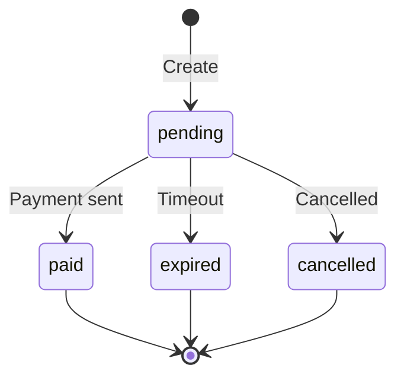

## Overview

Payment requests allow users to request payments from others. A pay request includes:

- Recipient name (resolved to meta-address)
- Amount and currency
- Optional memo
- QR code and payment URI
- Expiry time

<Info>
  All pay request endpoints are public and do not require authentication.
</Info>

## Endpoints

### Create Payment Request

Create a new payment request with QR code.

```http
POST /api/identipay/v1/pay-requests
```

#### Request Body

<ParamField body="recipientName" type="string" required>
  Recipient's registered name (3-20 characters)
</ParamField>

<ParamField body="amount" type="string" required>
  Payment amount (arbitrary precision string)
</ParamField>

<ParamField body="currency" type="string" required>
  Currency code (1-10 characters, e.g., "SUI", "USDC")
</ParamField>

<ParamField body="memo" type="string">
  Optional memo/description (max 500 characters)
</ParamField>

<ParamField body="expiresInSeconds" type="integer" default={3600}>
  Expiry duration in seconds (max 86400 = 24 hours)
</ParamField>

#### Response

<ResponseField name="requestId" type="string">
  UUID for this payment request
</ResponseField>

<ResponseField name="recipientName" type="string">
  Recipient name
</ResponseField>

<ResponseField name="amount" type="string">
  Payment amount
</ResponseField>

<ResponseField name="currency" type="string">
  Currency code
</ResponseField>

<ResponseField name="memo" type="string">
  Memo (if provided)
</ResponseField>

<ResponseField name="expiresAt" type="string">
  ISO 8601 expiry timestamp
</ResponseField>

<ResponseField name="status" type="string">
  Request status (`pending`)
</ResponseField>

<ResponseField name="qrDataUrl" type="string">
  QR code image as data URL (base64-encoded PNG)
</ResponseField>

<ResponseField name="uri" type="string">
  Payment URI for sharing
</ResponseField>

#### Example Request

<CodeGroup>
```bash cURL
curl -X POST https://api.identipay.com/api/identipay/v1/pay-requests \
  -H "Content-Type: application/json" \
  -d '{
    "recipientName": "alice",
    "amount": "10.00",
    "currency": "USDC",
    "memo": "Coffee payment",
    "expiresInSeconds": 3600
  }'
```

```typescript TypeScript
const response = await fetch(
  'https://api.identipay.com/api/identipay/v1/pay-requests',
  {
    method: 'POST',
    headers: { 'Content-Type': 'application/json' },
    body: JSON.stringify({
      recipientName: 'alice',
      amount: '10.00',
      currency: 'USDC',
      memo: 'Coffee payment',
      expiresInSeconds: 3600
    })
  }
);
const payRequest = await response.json();
```
</CodeGroup>

#### Example Response

```json
{
  "requestId": "550e8400-e29b-41d4-a716-446655440000",
  "recipientName": "alice",
  "amount": "10.00",
  "currency": "USDC",
  "memo": "Coffee payment",
  "expiresAt": "2026-03-09T21:15:00.000Z",
  "status": "pending",
  "qrDataUrl": "data:image/png;base64,iVBORw0KGgoAAAANSUhEUgAA...",
  "uri": "identipay:pay?recipient=alice&amount=10.00&currency=USDC&memo=Coffee%20payment"
}
```

#### Error Responses

<Expandable title="400 Validation Error">
  Invalid input parameters.
  
  ```json
  {
    "error": {
      "code": "VALIDATION_ERROR",
      "message": "Invalid pay request input",
      "details": {
        "fieldErrors": {
          "recipientName": ["String must contain at least 3 character(s)"],
          "amount": ["String must contain at least 1 character(s)"]
        }
      }
    }
  }
  ```
</Expandable>

<Expandable title="404 Not Found">
  Recipient name is not registered.
  
  ```json
  {
    "error": {
      "code": "NOT_FOUND",
      "message": "Recipient name \"alice\" is not registered"
    }
  }
  ```
</Expandable>

---

### Get Payment Request

Resolve a payment request by ID.

```http
GET /api/identipay/v1/pay-requests/:requestId
```

#### Path Parameters

<ParamField path="requestId" type="string" required>
  Payment request ID (UUID)
</ParamField>

#### Response

<ResponseField name="requestId" type="string">
  Payment request UUID
</ResponseField>

<ResponseField name="recipientName" type="string">
  Recipient name
</ResponseField>

<ResponseField name="amount" type="string">
  Payment amount
</ResponseField>

<ResponseField name="currency" type="string">
  Currency code
</ResponseField>

<ResponseField name="memo" type="string">
  Memo (if provided)
</ResponseField>

<ResponseField name="expiresAt" type="string">
  ISO 8601 expiry timestamp
</ResponseField>

<ResponseField name="status" type="string">
  Status: `pending`, `paid`, `expired`, or `cancelled`
</ResponseField>

<ResponseField name="recipient" type="object">
  Recipient meta-address (public keys only, NO Sui address)
  
  <Expandable title="Recipient Schema">
    <ResponseField name="name" type="string">
      Recipient name
    </ResponseField>
    
    <ResponseField name="spendPubkey" type="string">
      Spend public key (hex)
    </ResponseField>
    
    <ResponseField name="viewPubkey" type="string">
      View public key (hex)
    </ResponseField>
  </Expandable>
</ResponseField>

<Warning>
  Recipient meta-address includes ONLY public keys, never a Sui address.
</Warning>

#### Example Request

<CodeGroup>
```bash cURL
curl https://api.identipay.com/api/identipay/v1/pay-requests/550e8400-e29b-41d4-a716-446655440000
```

```typescript TypeScript
const requestId = '550e8400-e29b-41d4-a716-446655440000';
const response = await fetch(
  `https://api.identipay.com/api/identipay/v1/pay-requests/${requestId}`
);
const payRequest = await response.json();
```
</CodeGroup>

#### Example Response

```json
{
  "requestId": "550e8400-e29b-41d4-a716-446655440000",
  "recipientName": "alice",
  "amount": "10.00",
  "currency": "USDC",
  "memo": "Coffee payment",
  "expiresAt": "2026-03-09T21:15:00.000Z",
  "status": "pending",
  "recipient": {
    "name": "alice",
    "spendPubkey": "a1b2c3d4e5f6...",
    "viewPubkey": "f6e5d4c3b2a1..."
  }
}
```

#### Error Responses

<Expandable title="404 Not Found">
  Payment request does not exist.
  
  ```json
  {
    "error": {
      "code": "NOT_FOUND",
      "message": "Payment request not found"
    }
  }
  ```
</Expandable>

<Expandable title="400 Expired">
  Payment request has expired.
  
  ```json
  {
    "error": {
      "code": "VALIDATION_ERROR",
      "message": "Payment request has expired"
    }
  }
  ```
</Expandable>

<Expandable title="400 Invalid Status">
  Payment request is not pending.
  
  ```json
  {
    "error": {
      "code": "VALIDATION_ERROR",
      "message": "Payment request is paid"
    }
  }
  ```
</Expandable>

## Implementation Details

### Create Flow

When creating a payment request (see `routes/pay-requests.ts:15-76`):

1. **Validate Input**: Check recipient name, amount, currency
2. **Verify Recipient**: Ensure recipient name is registered (check DB cache or on-chain)
3. **Generate Request ID**: Create UUID
4. **Calculate Expiry**: Add `expiresInSeconds` to current time
5. **Build URI**: Create payment URI for QR code
6. **Generate QR Code**: Create base64 data URL
7. **Store Request**: Save to database with status `pending`
8. **Return Response**: Return request details with QR code

### Resolve Flow

When resolving a payment request (see `routes/pay-requests.ts:80-143`):

1. **Lookup Request**: Query database by request ID
2. **Check Expiry**: If expired, update status and return error
3. **Check Status**: Return error if not pending
4. **Resolve Recipient**: Fetch recipient meta-address (public keys only)
5. **Return Request**: Return request details with recipient public keys

### Payment URI Format

Payment URIs encode all request parameters:

```
identipay:pay?recipient={name}&amount={amount}&currency={currency}&memo={memo}
```

Example:
```
identipay:pay?recipient=alice&amount=10.00&currency=USDC&memo=Coffee%20payment
```

Wallets can:
- Scan QR code to extract URI
- Parse URI parameters
- Fetch full request details via API (optional)
- Generate stealth address from recipient meta-address
- Build and submit payment transaction

### Status Lifecycle



**Status Values**:
- `pending`: Awaiting payment
- `paid`: Payment confirmed
- `expired`: Expiry time passed
- `cancelled`: Request cancelled

<Info>
  The API does not currently track payment confirmations. Status remains `pending` unless manually updated.
</Info>

### Privacy Considerations

The payment request:
- Includes recipient name (public)
- Resolves to public keys only (no Sui address)
- Does not reveal payer identity
- Does not link request to on-chain transactions

Payers:
- Generate stealth addresses locally
- Send to stealth address (not recipient's main address)
- Remain anonymous to backend and merchant

## Use Cases

### Person-to-Person Payment

```typescript
// Alice creates a payment request
const request = await fetch('/api/identipay/v1/pay-requests', {
  method: 'POST',
  headers: { 'Content-Type': 'application/json' },
  body: JSON.stringify({
    recipientName: 'alice',
    amount: '25.00',
    currency: 'USDC',
    memo: 'Dinner split'
  })
}).then(r => r.json());

// Alice shares QR code or URI with Bob
const qrCode = request.qrDataUrl;
const uri = request.uri;

// Bob scans QR code and resolves request
const resolved = await fetch(
  `/api/identipay/v1/pay-requests/${request.requestId}`
).then(r => r.json());

// Bob generates stealth address
const stealthAddr = generateStealthAddress(
  resolved.recipient.spendPubkey,
  resolved.recipient.viewPubkey
);

// Bob sends payment
await sendPayment(stealthAddr, resolved.amount, resolved.currency);
```

### Point-of-Sale

```typescript
// Merchant creates payment request at checkout
const request = await createPayRequest({
  recipientName: 'acme_store',
  amount: totalAmount.toString(),
  currency: 'USDC',
  memo: `Order #${orderId}`,
  expiresInSeconds: 300 // 5 minutes
});

// Display QR code on terminal
displayQRCode(request.qrDataUrl);

// Customer scans and pays
// ...

// Poll for payment confirmation
const settled = await waitForSettlement(request.requestId);
```

## Related Endpoints

- [Names](/api/names) - Resolve names to meta-addresses
- [Transactions](/api/transactions) - Send stealth payments
- [Announcements](/api/announcements) - Track incoming payments
