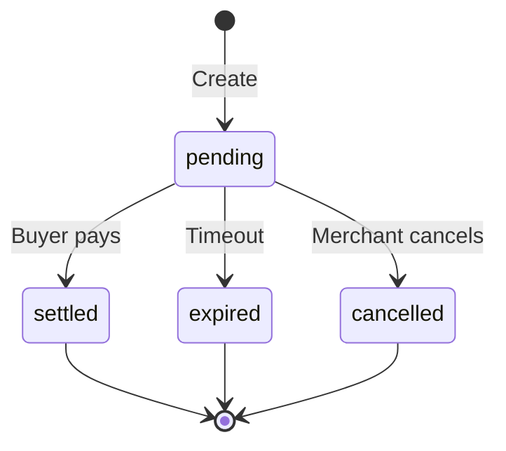

## Overview

Proposals are merchant-created payment intents that buyers scan and settle. Each proposal contains:

- Merchant information (DID, name, public key)
- Line items and total amount
- Deliverables (receipt, warranty)
- Constraints (age gate, region restrictions)
- Intent hash for on-chain settlement verification

<Info>
  All proposal endpoints require API key authentication.
</Info>

## Endpoints

### Create Proposal

Create a new commerce proposal and generate a QR code.

```http
POST /api/identipay/v1/proposals
```

<Info>
  Requires `Authorization: Bearer {apiKey}` header
</Info>

#### Request Body

<ParamField body="items" type="array" required>
  Array of line items in the purchase
  
  <Expandable title="Line Item Schema">
    <ResponseField name="name" type="string" required>
      Item name/description
    </ResponseField>
    
    <ResponseField name="quantity" type="integer" required>
      Quantity (positive integer)
    </ResponseField>
    
    <ResponseField name="unitPrice" type="string" required>
      Unit price as string (supports arbitrary precision)
    </ResponseField>
    
    <ResponseField name="currency" type="string">
      Currency code (optional, defaults to proposal-level currency)
    </ResponseField>
  </Expandable>
</ParamField>

<ParamField body="amount" type="object" required>
  Total amount for the transaction
  
  <Expandable title="Amount Schema">
    <ResponseField name="value" type="string" required>
      Total amount as string
    </ResponseField>
    
    <ResponseField name="currency" type="string" required>
      Currency code (e.g., "SUI", "USDC")
    </ResponseField>
  </Expandable>
</ParamField>

<ParamField body="deliverables" type="object" required>
  What the merchant will deliver
  
  <Expandable title="Deliverables Schema">
    <ResponseField name="receipt" type="boolean" required>
      Whether a receipt will be provided
    </ResponseField>
    
    <ResponseField name="warranty" type="object">
      Optional warranty terms
      
      <ResponseField name="durationDays" type="integer">
        Warranty duration in days (positive integer)
      </ResponseField>
      
      <ResponseField name="transferable" type="boolean">
        Whether warranty can be transferred
      </ResponseField>
    </ResponseField>
  </Expandable>
</ParamField>

<ParamField body="constraints" type="object">
  Optional purchase constraints
  
  <Expandable title="Constraints Schema">
    <ResponseField name="ageGate" type="integer">
      Minimum age requirement (requires ZK age proof)
    </ResponseField>
    
    <ResponseField name="regionRestriction" type="array">
      Array of allowed region codes
    </ResponseField>
  </Expandable>
</ParamField>

<ParamField body="expiresInSeconds" type="integer" default={900}>
  Proposal expiry in seconds (max 86400 = 24 hours)
</ParamField>

#### Response

<ResponseField name="transactionId" type="string">
  UUID for this transaction
</ResponseField>

<ResponseField name="intentHash" type="string">
  Hash of the proposal intent (used for on-chain verification)
</ResponseField>

<ResponseField name="qrDataUrl" type="string">
  Data URL of QR code image (base64-encoded PNG)
</ResponseField>

<ResponseField name="uri" type="string">
  Payment URI (identiPay protocol)
</ResponseField>

<ResponseField name="proposal" type="object">
  Full proposal object (JSON-LD CommerceProposal)
</ResponseField>

<ResponseField name="expiresAt" type="string">
  ISO 8601 timestamp when proposal expires
</ResponseField>

#### Example Request

<CodeGroup>
```bash cURL
curl -X POST https://api.identipay.com/api/identipay/v1/proposals \
  -H "Authorization: Bearer ip_live_abc123..." \
  -H "Content-Type: application/json" \
  -d '{
    "items": [
      {
        "name": "Coffee",
        "quantity": 2,
        "unitPrice": "5.00"
      }
    ],
    "amount": {
      "value": "10.00",
      "currency": "USDC"
    },
    "deliverables": {
      "receipt": true
    },
    "expiresInSeconds": 900
  }'
```

```typescript TypeScript
const response = await fetch(
  'https://api.identipay.com/api/identipay/v1/proposals',
  {
    method: 'POST',
    headers: {
      'Authorization': 'Bearer ip_live_abc123...',
      'Content-Type': 'application/json'
    },
    body: JSON.stringify({
      items: [
        {
          name: 'Coffee',
          quantity: 2,
          unitPrice: '5.00'
        }
      ],
      amount: {
        value: '10.00',
        currency: 'USDC'
      },
      deliverables: {
        receipt: true
      },
      expiresInSeconds: 900
    })
  }
);
const proposal = await response.json();
```
</CodeGroup>

#### Example Response

```json
{
  "transactionId": "550e8400-e29b-41d4-a716-446655440000",
  "intentHash": "a1b2c3d4e5f6...",
  "qrDataUrl": "data:image/png;base64,iVBORw0KGgoAAAANSUhEUgAA...",
  "uri": "identipay://acme.com/550e8400-e29b-41d4-a716-446655440000",
  "expiresAt": "2026-03-09T21:15:00.000Z",
  "proposal": {
    "@context": "https://schema.identipay.net/v1",
    "@type": "CommerceProposal",
    "transactionId": "550e8400-e29b-41d4-a716-446655440000",
    "merchant": {
      "did": "did:identipay:acme.com:...",
      "name": "Acme Store",
      "suiAddress": "0xabc123...",
      "publicKey": "a1b2c3d4..."
    },
    "items": [
      {
        "name": "Coffee",
        "quantity": 2,
        "unitPrice": "5.00"
      }
    ],
    "amount": {
      "value": "10.00",
      "currency": "USDC"
    },
    "deliverables": {
      "receipt": true
    },
    "constraints": null,
    "expiresAt": "2026-03-09T21:15:00.000Z",
    "intentHash": "a1b2c3d4e5f6...",
    "settlementChain": "sui",
    "settlementModule": "0x...::settlement"
  }
}
```

#### Error Responses

<Expandable title="401 Unauthorized">
  Missing or invalid API key.
  
  ```json
  {
    "error": {
      "code": "UNAUTHORIZED",
      "message": "Invalid API key"
    }
  }
  ```
</Expandable>

<Expandable title="400 Validation Error">
  Invalid proposal input.
  
  ```json
  {
    "error": {
      "code": "VALIDATION_ERROR",
      "message": "Invalid proposal input",
      "details": {
        "fieldErrors": {
          "items": ["Array must contain at least 1 element(s)"],
          "amount.value": ["Required"]
        }
      }
    }
  }
  ```
</Expandable>

## Implementation Details

### Proposal Creation Flow

When a proposal is created (see `routes/proposals.ts:17-68`):

1. **Authenticate**: Verify API key and load merchant info
2. **Validate Input**: Check all required fields and constraints
3. **Generate Transaction ID**: Create UUID for this transaction
4. **Build Proposal**: Create full JSON-LD CommerceProposal object
5. **Compute Intent Hash**: Hash the proposal for on-chain verification
6. **Generate QR Code**: Create QR code image and data URL
7. **Store Proposal**: Save to database with status "pending"
8. **Return Response**: Return transaction ID, QR code, and full proposal

### Proposal Schema (JSON-LD)

Proposals follow the CommerceProposal schema:

```json
{
  "@context": "https://schema.identipay.net/v1",
  "@type": "CommerceProposal",
  "transactionId": "uuid",
  "merchant": {
    "did": "did:identipay:...",
    "name": "...",
    "suiAddress": "0x...",
    "publicKey": "..."
  },
  "items": [...],
  "amount": {...},
  "deliverables": {...},
  "constraints": {...},
  "expiresAt": "ISO 8601",
  "intentHash": "...",
  "settlementChain": "sui",
  "settlementModule": "0x...::settlement"
}
```

### Intent Hash

The intent hash is computed from:
- Transaction ID
- Merchant DID
- Amount and currency
- Expiry timestamp
- Constraint requirements

This hash is verified on-chain during settlement to ensure the buyer is settling the exact proposal shown.

### QR Code Format

QR codes encode a payment URI:
```
identipay://{merchant-hostname}/{transaction-id}
```

Wallets scan this QR code and resolve the full proposal via the `/intents/:txId` endpoint.

### Proposal Lifecycle



**Status Values**:
- `pending`: Awaiting payment
- `settled`: Payment confirmed on-chain
- `expired`: Expiry time passed
- `cancelled`: Merchant cancelled

### Automatic Expiry

A background task runs every 30 seconds to mark expired proposals:

```typescript
setInterval(async () => {
  await db
    .update(proposals)
    .set({ status: "expired" })
    .where(
      and(
        eq(proposals.status, "pending"),
        lt(proposals.expiresAt, new Date())
      )
    );
}, 30_000);
```

## Related Endpoints

- [Intents](/api/intents) - Resolve proposal by transaction ID
- [Transactions](/api/transactions) - Check proposal status, submit settlement
- [WebSocket](/api/websocket) - Real-time proposal status updates
