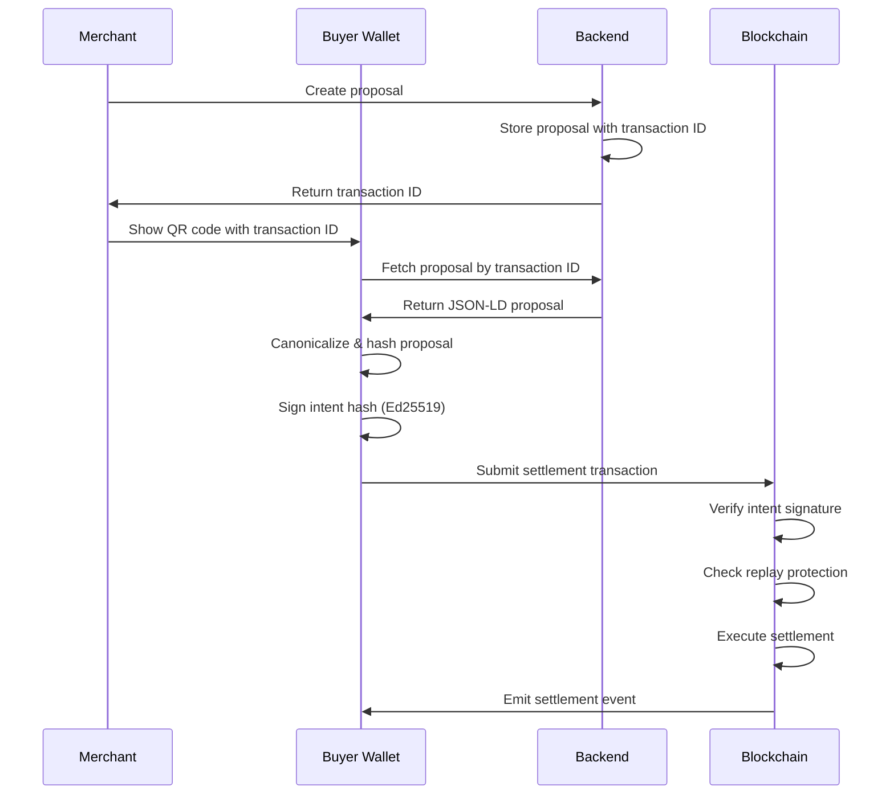

## Overview

Intent-based payments are the foundation of identiPay's payment authorization model. Unlike traditional pull-based payment systems where merchants initiate transactions, identiPay uses a **push-based intent model** where buyers explicitly sign and authorize each payment.

<Info>
  Intent signatures bind a buyer to a specific transaction proposal, providing cryptographic proof of authorization without revealing the buyer's on-chain identity.
</Info>

This approach provides several key benefits:

- **Privacy**: Buyers authorize payments without linking to their wallet address
- **Replay protection**: Each signed intent is unique and can only be executed once
- **Semantic binding**: Signatures cover the complete transaction context (amount, merchant, constraints)
- **Non-repudiation**: Cryptographic proof that the buyer authorized the specific transaction

## How intent signatures work

### Canonicalized proposal hashing

Before signing, the wallet must create a canonical representation of the payment proposal. This ensures that the signature semantically binds to the exact transaction terms.

<Steps>
  <Step title="Proposal representation">
    The merchant creates a JSON-LD commerce proposal containing:
    - Payment amount and currency
    - Merchant address
    - Expiry timestamp
    - Optional eligibility constraints (e.g., age requirements)
    - Receipt and warranty details
  </Step>

  <Step title="Canonicalization">
    The wallet canonicalizes the JSON-LD proposal using URDNA2015 normalization. This produces a deterministic byte representation regardless of JSON key ordering or whitespace.
  </Step>

  <Step title="Hash computation">
    The canonical bytes are hashed using SHA3-256 to produce the **intent hash** - a 32-byte identifier uniquely representing the proposal.
  </Step>

  <Step title="Signature generation">
    The buyer signs the intent hash using their Ed25519 private key, producing a 64-byte signature.
  </Step>
</Steps>

### On-chain verification

When the transaction is submitted, the `settlement` contract verifies the intent signature before processing the payment:

```move intent.move
/// Verify that `intent_sig` is a valid Ed25519 signature over `intent_hash`
/// by the holder of `public_key`. Aborts if verification fails.
///
/// The intent_hash is the SHA3-256 of the URDNA2015-canonicalized JSON-LD
/// commerce proposal, computed off-chain by the wallet.
public(package) fun verify_intent_signature(
    intent_sig: &vector<u8>,
    intent_hash: &vector<u8>,
    public_key: &vector<u8>,
) {
    assert!(intent_sig.length() == SIGNATURE_LENGTH, EInvalidSignatureLength);
    assert!(public_key.length() == PUBKEY_LENGTH, EInvalidPublicKeyLength);
    assert!(!intent_hash.is_empty(), EEmptyIntentHash);

    let valid = ed25519::ed25519_verify(intent_sig, public_key, intent_hash);
    assert!(valid, EInvalidSignature);
}
```

<Note>
  The intent signature uses Ed25519 for efficient on-chain verification on the Sui blockchain. Ed25519 signatures are 64 bytes and public keys are 32 bytes.
</Note>

## Intent lifecycle



### Replay protection

The settlement contract maintains a shared `SettlementState` object that tracks all executed intent hashes:

```move settlement.move
/// Shared state for settlement replay protection.
/// Tracks executed intent hashes to prevent the same signed intent
/// from being settled more than once.
public struct SettlementState has key {
    id: UID,
    /// intent_hash -> true (prevents replay of the same signed intent)
    executed_intents: Table<vector<u8>, bool>,
}
```

During settlement, the contract checks if an intent hash has already been executed:

```move settlement.move
// Replay protection: ensure this intent hasn't been settled before
assert!(!state.executed_intents.contains(intent_hash), EIntentAlreadyExecuted);
state.executed_intents.add(intent_hash, true);
```

<Warning>
  Once an intent is executed, it cannot be reused. Wallets must generate a new signature for each payment, even to the same merchant for the same amount.
</Warning>

## Integration example

Here's how the backend API resolves intent proposals:

```typescript intents.ts
// GET /:txId -- resolve a proposal by transaction ID (public endpoint)
// Per whitepaper section 6: https://<hostname>/api/identipay/v1/intents/<transaction-id>
app.get("/:txId", async (c) => {
  const txId = c.req.param("txId");

  const [proposal] = await deps.db
    .select()
    .from(proposals)
    .where(eq(proposals.transactionId, txId))
    .limit(1);

  if (!proposal) {
    throw new NotFoundError("Proposal not found");
  }

  // Check expiry
  if (new Date(proposal.expiresAt) < new Date()) {
    if (proposal.status === "pending") {
      await deps.db
        .update(proposals)
        .set({ status: "expired" })
        .where(eq(proposals.transactionId, txId));
    }
    throw new ValidationError("Proposal has expired");
  }

  if (proposal.status === "cancelled") {
    throw new ValidationError("Proposal has been cancelled");
  }

  return c.json(proposal.proposalJson);
});
```

## Why intent-based instead of pull-based?

Traditional payment systems use a **pull model** where merchants initiate transactions:

<CardGroup cols={2}>
  <Card title="Pull-based (traditional)" icon="credit-card">
    - Merchant initiates the transaction
    - Buyer provides card number or authorizes ACH
    - Merchant can charge at any time (subscription risk)
    - Requires trust in merchant's payment processor
    - Limited transaction-specific context
  </Card>
  
  <Card title="Intent-based (identiPay)" icon="signature">
    - Buyer initiates and authorizes each transaction
    - Signature semantically binds to exact proposal terms
    - One-time authorization, no recurring risk
    - On-chain verification, no trusted intermediary
    - Complete transaction context in signature
  </Card>
</CardGroup>

## Security considerations

<AccordionGroup>
  <Accordion title="Signature algorithm choice">
    identiPay uses Ed25519 (not ECDSA) for intent signatures because:
    - Fast on-chain verification (critical for settlement gas costs)
    - Deterministic signatures (no nonce reuse risk)
    - Native support in Sui Move's `sui::ed25519` module
    - Widely supported by hardware security modules
  </Accordion>

  <Accordion title="Intent hash binding">
    The intent hash commits to all transaction parameters:
    - Amount and currency type
    - Merchant address
    - Expiry timestamp
    - Eligibility constraints
    - Receipt and warranty terms
    
    This prevents parameter substitution attacks where an attacker might try to modify transaction details after signature generation.
  </Accordion>

  <Accordion title="Expiry enforcement">
    All proposals have an expiry timestamp that is checked during settlement:
    
    ```move
    assert!(proposal_expiry > ctx.epoch_timestamp_ms(), EProposalExpired);
    ```
    
    This limits the window for signature replay and ensures buyers can't be charged for stale proposals.
  </Accordion>
</AccordionGroup>

## Related concepts

<CardGroup cols={2}>
  <Card title="Stealth addresses" icon="eye-slash" href="/concepts/stealth-addresses">
    Learn how buyers receive receipts at unlinkable addresses
  </Card>
  <Card title="Zero-knowledge proofs" icon="shield-check" href="/concepts/zero-knowledge-proofs">
    Understand how eligibility constraints are verified privately
  </Card>
</CardGroup>