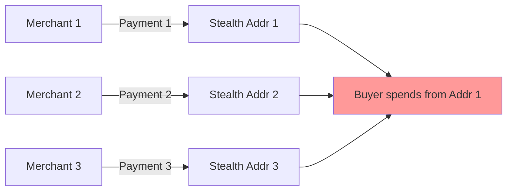
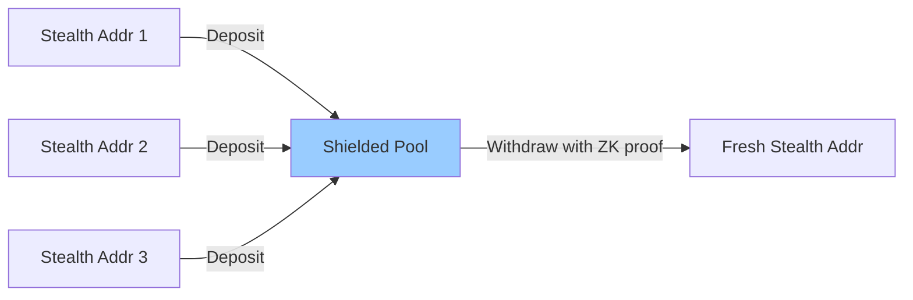

## Overview

Shielded pools are privacy-preserving smart contracts that allow users to deposit tokens with a cryptographic commitment and later withdraw to a different address using a zero-knowledge proof. This breaks the on-chain link between deposits and withdrawals, preventing address clustering and transaction graph analysis.

<Info>
  Shielded pools act as a **privacy firewall**: observers can see deposits going in and withdrawals coming out, but cannot determine which deposits correspond to which withdrawals.
</Info>

identiPay's shielded pool implementation uses:
- **Poseidon hash** for Merkle tree construction (efficient ZK-SNARK verification)
- **Incremental Merkle trees** for efficient on-chain state updates
- **Nullifiers** to prevent double-spending
- **Groth16 ZK proofs** to prove note ownership without revealing which note

## Why shielded pools?

### The address clustering problem

Stealth addresses prevent linking payments to a buyer's identity, but they don't solve the **spending privacy** problem:



If a buyer combines funds from multiple stealth addresses in a single transaction, on-chain analysis can cluster those addresses as belonging to the same user.

### How shielded pools solve it



The shielded pool breaks the link: observers see deposits and withdrawals but cannot correlate them.

## Data structures

### Pool state

The shielded pool contract maintains:

```move shielded_pool.move
/// The shielded pool. Holds token balances and tracks an incremental
/// Merkle tree of note commitments and spent nullifiers.
///
/// The Merkle tree uses a "filled subtrees" approach: we store one hash
/// per level representing the most recently completed subtree at that
/// depth. This allows O(depth) insertion without storing every node.
public struct ShieldedPool<phantom T> has key {
    id: UID,
    /// Pool balance
    balance: Balance<T>,
    /// Current Merkle root of the note commitment tree (BN254 field element)
    merkle_root: u256,
    /// Spent nullifiers (prevents double-spend)
    nullifiers: Table<u256, bool>,
    /// Next leaf index in the Merkle tree
    next_leaf_index: u64,
    /// Filled subtrees: one Poseidon hash per level (index 0 = leaf level).
    /// When a subtree at level i is completed, its root is stored here
    /// and used as the left child when computing the next level up.
    filled_subtrees: vector<u256>,
    /// Merkle tree depth (determines max capacity: 2^depth notes)
    tree_depth: u8,
}
```

<Note>
  The pool is generic over token type `T`, so separate pools exist for USDC, SUI, or other coins. This prevents mixing different token types.
</Note>

### Note commitments

A note commitment is a Poseidon hash of:
- **amount**: The quantity of tokens in the note
- **owner_key**: The note owner's secret key
- **salt**: Random value for uniqueness

```
note_commitment = Poseidon(amount, owner_key, salt)
```

The commitment is stored in the Merkle tree, hiding the note's details while allowing the owner to later prove ownership.

### Nullifiers

To prevent double-spending, each note has a unique nullifier:

```
nullifier = Poseidon(note_commitment, owner_key)
```

When withdrawing, the nullifier is revealed and marked as spent. The ZK proof ensures the nullifier corresponds to a valid note without revealing which one.

## Deposit flow

<Steps>
  <Step title="Compute note commitment">
    Off-chain (in the wallet), generate a random salt and compute:
    
    ```javascript
    noteCommitment = poseidon([amount, ownerKey, salt])
    ```
    
    Store `(amount, ownerKey, salt)` locally - you'll need this data to withdraw later.
  </Step>

  <Step title="Deposit tokens">
    Call the `deposit` entry function:
    
    ```move shielded_pool.move
    entry fun deposit<T>(
        pool: &mut ShieldedPool<T>,
        coin: Coin<T>,
        note_commitment: u256,
        _ctx: &mut TxContext,
    )
    ```
  </Step>

  <Step title="Merkle tree insertion">
    The contract adds the commitment to the Merkle tree and updates the root:
    
    ```move shielded_pool.move
    // Add coin to pool balance
    let coin_balance = coin::into_balance(coin);
    balance::join(&mut pool.balance, coin_balance);

    // Insert leaf into the incremental Merkle tree and recompute root
    let leaf_index = pool.next_leaf_index;
    let new_root = insert_leaf(pool, note_commitment);
    pool.merkle_root = new_root;
    pool.next_leaf_index = leaf_index + 1;
    ```
  </Step>

  <Step title="Deposit event">
    A `DepositEvent` is emitted with the commitment, leaf index, and new root:
    
    ```move shielded_pool.move
    event::emit(DepositEvent {
        note_commitment,
        leaf_index,
        new_merkle_root: pool.merkle_root,
    });
    ```
    
    The wallet uses this to track the Merkle path for later withdrawal proofs.
  </Step>
</Steps>

<Warning>
  The wallet MUST save `(amount, ownerKey, salt, leaf_index, merkle_path)` locally. This data is not stored on-chain and is required to generate withdrawal proofs.
</Warning>

## Withdrawal flow

<Steps>
  <Step title="Generate ZK proof">
    Off-chain, the wallet constructs a Circom input proving:
    - Knowledge of `(amount, ownerKey, salt)` such that `Poseidon(amount, ownerKey, salt)` equals a commitment in the tree
    - The Merkle path from the commitment to the current root
    - The nullifier derivation: `nullifier = Poseidon(commitment, ownerKey)`
    - The withdrawal amount is ≤ the note amount
    
    See [Zero-knowledge proofs](/concepts/zero-knowledge-proofs) for circuit details.
  </Step>

  <Step title="Call withdraw">
    Submit the proof to the contract:
    
    ```move shielded_pool.move
    entry fun withdraw<T>(
        pool: &mut ShieldedPool<T>,
        vk: &VerificationKey,
        proof: vector<u8>,
        public_inputs: vector<u8>,
        nullifier: u256,
        recipient: address,
        amount: u64,
        change_commitment: u256,
        ctx: &mut TxContext,
    )
    ```
  </Step>

  <Step title="Verify proof">
    The contract verifies the Groth16 proof:
    
    ```move shielded_pool.move
    // Check nullifier hasn't been spent
    assert!(!pool.nullifiers.contains(nullifier), ENullifierAlreadySpent);

    // Verify ZK proof
    let proof_valid = zk_verifier::verify_proof(vk, &proof, &public_inputs);
    assert!(proof_valid, EProofVerificationFailed);

    // Mark nullifier as spent
    pool.nullifiers.add(nullifier, true);
    ```
  </Step>

  <Step title="Handle change">
    If withdrawing less than the full note amount, a change commitment is inserted:
    
    ```move shielded_pool.move
    // If there's change, insert the change commitment into the Merkle tree
    if (change_commitment != 0) {
        let new_root = insert_leaf(pool, change_commitment);
        pool.merkle_root = new_root;
        pool.next_leaf_index = pool.next_leaf_index + 1;
    };
    ```
    
    The wallet can later withdraw the change using a new proof.
  </Step>

  <Step title="Transfer tokens">
    The contract transfers tokens to the recipient (typically a fresh stealth address):
    
    ```move shielded_pool.move
    // Transfer tokens to recipient
    let withdraw_balance = balance::split(&mut pool.balance, amount);
    let withdraw_coin = coin::from_balance(withdraw_balance, ctx);
    transfer::public_transfer(withdraw_coin, recipient);
    ```
  </Step>
</Steps>

## Incremental Merkle tree

### Why Poseidon?

identiPay uses the Poseidon hash function for the Merkle tree because:

- **ZK-friendly**: Poseidon requires ~10x fewer constraints in Circom circuits compared to SHA-256
- **Native support**: Sui Move has a built-in `sui::poseidon` module for BN254 field elements
- **Circomlib compatibility**: The circuit uses `circomlib`'s Poseidon implementation, ensuring consistency

```move shielded_pool.move
/// Hash two BN254 field elements together using Poseidon.
/// This matches the circomlib Poseidon hash for 2 inputs.
fun hash_pair(left: u256, right: u256): u256 {
    let data = vector[left, right];
    poseidon::poseidon_bn254(&data)
}
```

### Filled subtrees optimization

Storing a full Merkle tree on-chain would be prohibitively expensive. Instead, the contract uses an **incremental Merkle tree** with "filled subtrees":

- Store one hash per level (not every node)
- When inserting a leaf, walk up the tree and update only the path to the root
- Complexity: O(depth) per insertion instead of O(2^depth) storage

```move shielded_pool.move
/// Insert a leaf into the incremental Merkle tree and return the new root.
///
/// Algorithm: Starting from the leaf level, walk up the tree. At each level,
/// if the current index is even (left child), the sibling is the zero hash
/// at that level; if odd (right child), the sibling is the stored filled
/// subtree at that level. When the current index is even, we update the
/// filled_subtrees entry for that level because we just completed a left subtree.
fun insert_leaf<T>(pool: &mut ShieldedPool<T>, leaf: u256): u256 {
    let mut current_index = pool.next_leaf_index;
    let mut current_hash = leaf;
    let depth = pool.tree_depth as u64;

    // Precompute zero hashes for each level
    let mut zero_hashes = vector[];
    let mut zh = zero_leaf();
    let mut i = 0;
    while (i < depth) {
        zero_hashes.push_back(zh);
        zh = hash_pair(zh, zh);
        i = i + 1;
    };

    i = 0;
    while (i < depth) {
        if (current_index % 2 == 0) {
            // Left child: sibling is the zero hash at this level.
            *pool.filled_subtrees.borrow_mut(i) = current_hash;
            current_hash = hash_pair(current_hash, *zero_hashes.borrow(i));
        } else {
            // Right child: sibling is the stored filled subtree (left neighbor).
            let left = *pool.filled_subtrees.borrow(i);
            current_hash = hash_pair(left, current_hash);
        };
        current_index = current_index / 2;
        i = i + 1;
    };

    current_hash
}
```

<Tip>
  The default tree depth is 20, supporting up to 2^20 ≈ 1 million notes per pool. This is sufficient for most use cases while keeping proof size reasonable (20 sibling hashes).
</Tip>

## Privacy guarantees

### Anonymity set

The privacy of a withdrawal depends on the **anonymity set** - the number of possible deposits it could correspond to:

- Small anonymity set (few deposits): Easier to correlate deposits/withdrawals via timing or amount analysis
- Large anonymity set (many deposits): Strong privacy protection

<Info>
  identiPay's anonymity set grows with every deposit to the pool. A pool with 10,000 deposits provides strong privacy even if an attacker knows the withdrawal amount.
</Info>

### Amount correlation

To maximize privacy:

- **Deposit standard amounts** (e.g., 10 USDC, 100 USDC, 1000 USDC) instead of arbitrary amounts like 127.43 USDC
- **Wait before withdrawing** - don't deposit and immediately withdraw
- **Withdraw to fresh stealth addresses** - never reuse withdrawal addresses

### Limitations

<Warning>
  Shielded pools do not hide:
  - That you deposited into the pool (deposit transaction is public)
  - That you withdrew from the pool (withdrawal transaction is public)
  - The total pool balance and number of notes
  
  Observers can perform statistical analysis on deposit/withdrawal patterns, especially if the pool has low activity.
</Warning>

## Pool capacity and gas costs

Each pool has a maximum capacity determined by the tree depth:

```move shielded_pool.move
const DEFAULT_TREE_DEPTH: u8 = 20; // 2^20 = ~1M notes
```

Deeper trees support more notes but increase:
- **Proof generation time** (more Merkle path elements to hash)
- **Proof size** (more public inputs)
- **Verification gas costs** (more constraints to check)

Trade-off:

| Tree Depth | Capacity | Proof Size | Typical Gas Cost |
|------------|----------|------------|------------------|
| 16 | 65,536 | ~2 KB | ~150K gas |
| 20 | 1,048,576 | ~2.5 KB | ~200K gas |
| 24 | 16,777,216 | ~3 KB | ~250K gas |

<Tip>
  Most deployments should use depth 20. Only increase depth if expecting millions of deposits or if gas costs are not a concern.
</Tip>

## Security considerations

<AccordionGroup>
  <Accordion title="Nullifier uniqueness">
    The nullifier must be unique per note and deterministic:
    
    ```
    nullifier = Poseidon(note_commitment, owner_key)
    ```
    
    This ensures:
    - Two withdrawals of the same note produce the same nullifier (double-spend prevention)
    - Different notes produce different nullifiers (even if owned by the same user)
    - An attacker cannot guess nullifiers without knowing the owner key
  </Accordion>

  <Accordion title="Merkle root validation">
    The ZK proof must include the current Merkle root as a public input. This binds the proof to a specific tree state, preventing:
    
    - Replay attacks using old proofs
    - Proofs referencing notes that were never deposited
    
    The contract checks:
    
    ```move
    merkleProof.root === merkleRoot
    ```
    
    in the circuit, ensuring the prover used the current tree state.
  </Accordion>

  <Accordion title="Change commitment security">
    When making a partial withdrawal, the wallet must:
    
    1. Generate a fresh random salt for the change note
    2. Include the change commitment in the ZK proof public inputs
    3. Store the change note data locally for future withdrawal
    
    <Warning>
      Never reuse the original note's salt for the change commitment. This would allow an observer to link the change note to the original deposit.
    </Warning>
  </Accordion>
</AccordionGroup>

## Usage example

Here's a typical workflow for using shielded pools:

```javascript
// 1. Deposit from a stealth address
const salt = randomBytes(32);
const noteCommitment = poseidon([amount, ownerKey, salt]);

await pool.deposit(coin, noteCommitment);

// Store note data locally
storeNote({
  amount,
  ownerKey,
  salt,
  leafIndex: pool.next_leaf_index - 1,
  merkleRoot: pool.merkle_root,
});

// 2. Later, withdraw to a fresh address
const withdrawAmount = amount; // or less for partial withdrawal
const changeAmount = amount - withdrawAmount;
const changeCommitment = changeAmount > 0 
  ? poseidon([changeAmount, ownerKey, randomBytes(32)])
  : 0;

const nullifier = poseidon([noteCommitment, ownerKey]);

// Generate ZK proof (off-chain)
const { proof, publicInputs } = await generatePoolSpendProof({
  noteAmount: amount,
  ownerKey,
  salt,
  merkleRoot: pool.merkle_root,
  merklePath,
  nullifier,
  withdrawAmount,
  changeCommitment,
  recipient: freshStealthAddress,
});

// Submit withdrawal
await pool.withdraw(
  verificationKey,
  proof,
  publicInputs,
  nullifier,
  freshStealthAddress,
  withdrawAmount,
  changeCommitment,
);
```

## Related concepts

<CardGroup cols={2}>
  <Card title="Zero-knowledge proofs" icon="shield-check" href="/concepts/zero-knowledge-proofs">
    Learn how withdrawal proofs are constructed and verified
  </Card>
  <Card title="Stealth addresses" icon="eye-slash" href="/concepts/stealth-addresses">
    Understand how to generate fresh addresses for withdrawals
  </Card>
</CardGroup>