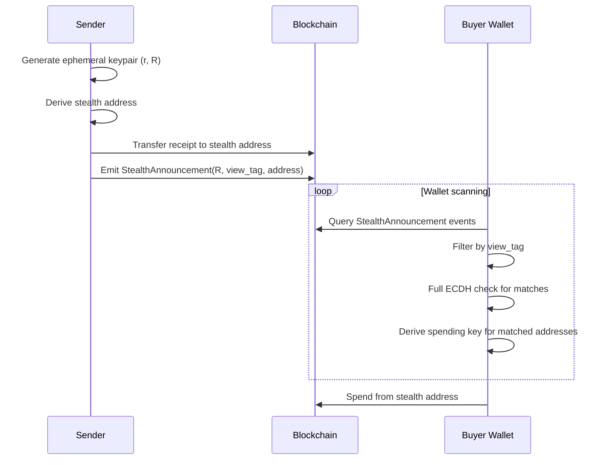

## Overview

Stealth addresses are one-time addresses that allow buyers to receive on-chain assets (receipts, warranties) without revealing their identity or creating an on-chain transaction graph. Each payment generates a fresh, unlinkable address that only the buyer can detect and spend from.

<Info>
  Stealth addresses provide **receiver privacy**: observers see payments to unique addresses but cannot determine who controls them or link them to other payments.
</Info>

identiPay's stealth address implementation uses elliptic curve Diffie-Hellman (ECDH) key exchange combined with view tags for efficient scanning.

## Key concepts

### Address derivation

Each buyer has two public keys:

- **Spend public key** (`K_spend`): Ed25519 key for signing transactions
- **View public key** (`K_view`): X25519 key for ECDH and payment detection

To send a payment to a buyer, the sender:

<Steps>
  <Step title="Generate ephemeral keypair">
    Create a random X25519 ephemeral private key `r` and compute `R = r·G` (ephemeral public key).
  </Step>

  <Step title="Compute shared secret">
    Perform ECDH: `shared = x25519(r, K_view)` using the buyer's view public key.
  </Step>

  <Step title="Derive stealth scalar">
    Compute `s = SHA-256(shared || "identipay-stealth-v1")` where the domain separator prevents cross-protocol attacks.
  </Step>

  <Step title="Compute stealth public key">
    Using Ed25519 point addition: `K_stealth = K_spend + s·G`
  </Step>

  <Step title="Derive Sui address">
    Hash the stealth public key: `address = BLAKE2b-256(0x00 || K_stealth)`
    
    This follows Sui's address derivation where `0x00` is the Ed25519 signature scheme flag.
  </Step>
</Steps>

### View tags for fast scanning

Without optimization, buyers would need to perform an ECDH computation for every payment announcement on the blockchain - expensive for wallets scanning thousands of transactions.

identiPay uses **view tags** to accelerate scanning by ~256x:

```typescript stealth.service.ts
/**
 * Extract view tag: first byte of the shared secret.
 */
export function extractViewTag(sharedSecret: Uint8Array): number {
  return sharedSecret[0];
}
```

The sender includes the first byte of the shared secret in the announcement. The buyer can quickly filter out 255/256 of announcements by comparing view tags before performing the full ECDH derivation.

## Implementation

### Sender-side derivation

The backend service implements stealth address generation:

```typescript stealth.service.ts
/**
 * Full stealth address derivation from sender side.
 * Sender knows: K_spend (Ed25519), K_view (X25519)
 * Sender generates ephemeral X25519 keypair.
 */
export function deriveStealthAddress(
  spendPubkey: Uint8Array,
  viewPubkey: Uint8Array,
  ephemeralPrivateKey?: Uint8Array,
): StealthOutput {
  // Generate or use provided ephemeral X25519 keypair
  const ephPriv = ephemeralPrivateKey ?? x25519.utils.randomPrivateKey();
  const ephPub = x25519.getPublicKey(ephPriv);

  // ECDH shared secret
  const shared = ecdhSharedSecret(ephPriv, viewPubkey);

  // View tag
  const viewTag = extractViewTag(shared);

  // Stealth scalar
  const scalar = deriveStealthScalar(shared);

  // Stealth pubkey = K_spend + s*G
  const stealthPubkey = computeStealthPubkey(spendPubkey, scalar);

  // Sui address
  const stealthAddress = pubkeyToSuiAddress(stealthPubkey);

  return {
    ephemeralPubkey: ephPub,
    stealthAddress,
    viewTag,
    stealthPubkey,
  };
}
```

The core cryptographic operations:

```typescript stealth.service.ts
/**
 * Compute ECDH shared secret between an X25519 private key and public key.
 */
export function ecdhSharedSecret(
  privateKey: Uint8Array,
  publicKey: Uint8Array,
): Uint8Array {
  return x25519.getSharedSecret(privateKey, publicKey);
}

/**
 * Derive the stealth scalar from a shared secret.
 * s = SHA-256(shared || "identipay-stealth-v1")
 */
export function deriveStealthScalar(sharedSecret: Uint8Array): Uint8Array {
  return sha256(concatBytes(sharedSecret, DOMAIN_SEPARATOR));
}

/**
 * Compute stealth public key: K_stealth = K_spend + s*G
 * Uses Ed25519 point arithmetic.
 */
export function computeStealthPubkey(
  spendPubkey: Uint8Array,
  scalar: Uint8Array,
): Uint8Array {
  const sG = ed25519.ExtendedPoint.BASE.multiply(
    bytesToBigInt(scalar),
  );
  const kSpend = ed25519.ExtendedPoint.fromHex(spendPubkey);
  const kStealth = kSpend.add(sG);
  return kStealth.toRawBytes();
}
```

<Note>
  The implementation uses X25519 for ECDH (optimized for key exchange) and Ed25519 for the stealth public key derivation (compatible with Sui addresses).
</Note>

### On-chain announcements

When a payment is sent to a stealth address, the sender emits an announcement event that the buyer can scan:

```move announcements.move
/// Emitted when a payment is sent to a stealth address.
/// Recipients scan these events to detect incoming payments.
public struct StealthAnnouncement has copy, drop {
    /// Ephemeral public key R = r*G (32 bytes).
    /// The recipient uses this with their viewing private key to derive
    /// the shared secret and detect if this payment is for them.
    ephemeral_pubkey: vector<u8>,
    /// First byte of the ECDH shared secret (fast 1-byte filter).
    /// Reduces full ECDH computations by ~256x during scanning.
    view_tag: u8,
    /// The derived one-time stealth address where the payment was sent.
    stealth_address: address,
    /// Optional encrypted memo (e.g., payment reason).
    metadata: vector<u8>,
}
```

The announcement function validates the ephemeral key and emits the event:

```move announcements.move
/// Emit a stealth payment announcement. Called by anyone sending to
/// a stealth address (P2P payments, commerce settlements).
entry fun announce(
    ephemeral_pubkey: vector<u8>,
    view_tag: u8,
    stealth_address: address,
    metadata: vector<u8>,
    _ctx: &mut TxContext,
) {
    assert!(ephemeral_pubkey.length() == PUBKEY_LENGTH, EInvalidEphemeralPubkey);

    event::emit(StealthAnnouncement {
        ephemeral_pubkey,
        view_tag,
        stealth_address,
        metadata,
    });
}
```

### Receiver-side scanning

The buyer's wallet scans announcement events to detect incoming payments:

```typescript stealth.service.ts
/**
 * Receiver-side: check if an announcement is addressed to us.
 * Receiver knows: k_view (X25519 private), K_spend (Ed25519 public)
 */
export function scanAnnouncement(
  viewPrivateKey: Uint8Array,
  spendPubkey: Uint8Array,
  ephemeralPubkey: Uint8Array,
  announcedViewTag: number,
  announcedStealthAddress: string,
): boolean {
  const shared = ecdhSharedSecret(viewPrivateKey, ephemeralPubkey);
  const viewTag = extractViewTag(shared);

  // Fast filter: check view tag first (256x speedup)
  if (viewTag !== announcedViewTag) return false;

  // Full derivation to confirm
  const scalar = deriveStealthScalar(shared);
  const stealthPubkey = computeStealthPubkey(spendPubkey, scalar);
  const stealthAddress = pubkeyToSuiAddress(stealthPubkey);

  return stealthAddress === announcedStealthAddress;
}
```

<Tip>
  The two-phase check (view tag filter, then full derivation) makes wallet scanning practical even with thousands of announcements per block.
</Tip>

## Payment flow



## Spending from stealth addresses

To spend from a stealth address, the buyer must derive the corresponding private key:

1. Detect an incoming payment using `scanAnnouncement`
2. Compute the shared secret: `shared = x25519(k_view, R)` where `k_view` is the viewing private key and `R` is the ephemeral public key
3. Derive the stealth scalar: `s = SHA-256(shared || domain)`
4. Compute the stealth private key: `k_stealth = k_spend + s` (scalar addition mod curve order)
5. Sign transactions using `k_stealth`

<Warning>
  The stealth private key must be computed fresh for each stealth address. Never reuse or cache stealth private keys - they are specific to each payment.
</Warning>

## Privacy properties

### What observers see

On-chain observers (block explorers, analytics tools) can see:

- Payments to unique addresses that are never reused
- Ephemeral public keys and view tags in announcements
- Which stealth addresses receive assets

### What observers cannot see

- Who controls a stealth address (no link to the buyer's identity)
- Which stealth addresses belong to the same buyer
- The buyer's viewing or spending keys
- Whether two payments are to the same recipient

<Info>
  Stealth addresses break **forward tracing** (following payments from a known address) and **backward tracing** (finding the source of funds to an address).
</Info>

## Security considerations

<AccordionGroup>
  <Accordion title="Ephemeral key generation">
    The security of stealth addresses depends on generating cryptographically secure random ephemeral keys. The implementation uses:
    
    ```typescript
    const ephPriv = ephemeralPrivateKey ?? x25519.utils.randomPrivateKey();
    ```
    
    This uses the `@noble/curves` library which sources randomness from `crypto.getRandomValues()` (browser) or `crypto.randomBytes()` (Node.js).
    
    <Warning>
      Never reuse ephemeral keys across multiple payments. Each payment must generate a fresh random key.
    </Warning>
  </Accordion>

  <Accordion title="Domain separation">
    The stealth scalar derivation includes a domain separator:
    
    ```typescript
    const DOMAIN_SEPARATOR = new TextEncoder().encode("identipay-stealth-v1");
    ```
    
    This prevents cross-protocol attacks where the same keypair might be used for different purposes. The domain separator ensures that stealth scalars derived for identiPay cannot collide with other systems.
  </Accordion>

  <Accordion title="View key security">
    The view private key (`k_view`) allows detection of incoming payments but not spending. This enables:
    
    - Wallet syncing across devices (share view key only)
    - Third-party transaction monitoring (give auditor the view key)
    - Light clients that detect payments without holding spend keys
    
    However, view key compromise reveals:
    - All stealth addresses controlled by the user
    - Payment amounts and timing
    - Links between different payments to the same recipient
    
    <Tip>
      Protect view keys with the same security as spending keys. Even though they can't spend funds, they reveal significant privacy information.
    </Tip>
  </Accordion>
</AccordionGroup>

## Integration with shielded pools

Stealth addresses work in combination with [shielded pools](/concepts/shielded-pools) to provide complete payment privacy:

1. Buyer receives payments at multiple stealth addresses
2. Buyer deposits funds from stealth addresses into shielded pool
3. Buyer withdraws merged funds to a fresh stealth address for spending

This breaks on-chain transaction graphs by obscuring the link between received and spent funds.

## Related concepts

<CardGroup cols={2}>
  <Card title="Intent-based payments" icon="signature" href="/concepts/intent-based-payments">
    Learn how buyers authorize payments without revealing identity
  </Card>
  <Card title="Shielded pools" icon="shield-halved" href="/concepts/shielded-pools">
    Understand how to merge funds from multiple stealth addresses
  </Card>
</CardGroup>