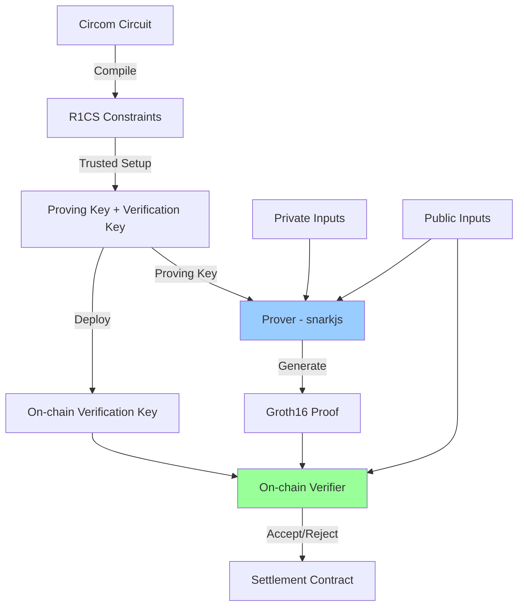

## Overview

Zero-knowledge proofs (ZK proofs) allow one party (the prover) to convince another party (the verifier) that a statement is true without revealing any information beyond the truth of the statement itself.

identiPay uses ZK proofs for two primary purposes:

1. **Eligibility verification**: Prove you meet age or other requirements without revealing your birthdate or identity
2. **Shielded pool withdrawals**: Prove you own a note in the pool without revealing which note

<Info>
  identiPay uses **Groth16**, a ZK-SNARK proof system known for small proof size (~192 bytes) and fast verification. Proofs are verified on-chain using Sui's native `sui::groth16` module.
</Info>

## Proof system architecture



### Components

- **Circom circuits**: Define the computation to be proven (written in Circom language)
- **Trusted setup**: One-time ceremony generating proving and verification keys
- **Prover**: Off-chain (wallet) - generates proofs using private inputs
- **Verifier**: On-chain (smart contract) - verifies proofs using only public inputs

## Age check circuit

The age check circuit proves a user meets a minimum age threshold without revealing their exact birthdate.

### Circuit inputs

```circom age_check.circom
template AgeCheck() {
    // Private inputs
    signal input birthYear;
    signal input birthMonth;
    signal input birthDay;
    signal input dobHash;
    signal input userSalt;

    // Public inputs
    signal input ageThreshold;
    signal input referenceDate;
    signal input identityCommitment;
    signal input intentHash;
    
    // ... constraints ...
}

component main {public [ageThreshold, referenceDate, identityCommitment, intentHash]} = AgeCheck();
```

<Note>
  Public inputs are visible on-chain and included in the proof. Private inputs never leave the prover's device.
</Note>

### Constraints

The circuit enforces several constraints:

<AccordionGroup>
  <Accordion title="1. DOB hash verification">
    Verify that the provided birthdate matches a previously committed hash:
    
    ```circom age_check.circom
    // Verify dobHash = Poseidon(birthYear, birthMonth, birthDay)
    component dobHasher = Poseidon(3);
    dobHasher.inputs[0] <== birthYear;
    dobHasher.inputs[1] <== birthMonth;
    dobHasher.inputs[2] <== birthDay;
    dobHasher.out === dobHash;
    ```
    
    This prevents the prover from lying about their birthdate.
  </Accordion>

  <Accordion title="2. Date parsing and validation">
    Parse the reference date (YYYYMMDD integer) and validate components:
    
    ```circom age_check.circom
    refMonthDay <-- referenceDate % 10000;
    refYear <-- (referenceDate - refMonthDay) / 10000;
    
    // Constrain: referenceDate == refYear * 10000 + refMonthDay
    signal refYearTimes10000;
    refYearTimes10000 <== refYear * 10000;
    refYearTimes10000 + refMonthDay === referenceDate;
    ```
    
    Range checks ensure month ∈ [1,12] and day ∈ [1,31].
  </Accordion>

  <Accordion title="3. Age computation with month/day precision">
    Calculate effective age accounting for whether birthday has passed this year:
    
    ```circom age_check.circom
    signal rawAge;
    rawAge <== refYear - birthYear;

    // Compute birthMonthDay and refMonthDay for comparison
    signal birthMonthDay;
    birthMonthDay <== birthMonth * 100 + birthDay;

    // hasBirthdayPassed: 1 if refMonthDay >= birthMonthDay, else 0
    component birthdayCheck = GreaterEqThan(16);
    birthdayCheck.in[0] <== refMonthDay;
    birthdayCheck.in[1] <== birthMonthDay;

    // effectiveAge = rawAge - 1 + hasBirthdayPassed
    signal effectiveAge;
    effectiveAge <== rawAge - 1 + birthdayCheck.out;
    ```
  </Accordion>

  <Accordion title="4. Threshold check">
    Verify the user meets the minimum age requirement:
    
    ```circom age_check.circom
    component ageGte = GreaterEqThan(16);
    ageGte.in[0] <== effectiveAge;
    ageGte.in[1] <== ageThreshold;
    ageGte.out === 1;
    ```
    
    The proof fails if `effectiveAge < ageThreshold`.
  </Accordion>

  <Accordion title="5. Intent binding">
    Bind the proof to a specific transaction intent (prevents replay):
    
    ```circom age_check.circom
    // These signals are public inputs declared in main.
    // We create dummy constraints to ensure they are not
    // optimized away by the compiler.
    signal identitySquared;
    identitySquared <== identityCommitment * identityCommitment;

    signal intentSquared;
    intentSquared <== intentHash * intentHash;
    ```
    
    The `intentHash` public input links this proof to a specific payment, preventing reuse.
  </Accordion>
</AccordionGroup>

### Complexity

The age check circuit has approximately **1,500 constraints**, making proof generation fast (~50ms on modern hardware) and verification cheap (~100K gas).

## Pool spend circuit

The pool spend circuit proves the right to withdraw from a shielded pool without revealing which note is being spent.

### Circuit inputs

```circom pool_spend.circom
template PoolSpend(depth) {
    // Private inputs
    signal input noteAmount;
    signal input ownerKey;
    signal input salt;
    signal input pathElements[depth];
    signal input pathIndices[depth];

    // Public inputs
    signal input merkleRoot;
    signal input nullifier;
    signal input recipient;
    signal input withdrawAmount;
    signal input changeCommitment;
    
    // ... constraints ...
}

component main {public [merkleRoot, nullifier, recipient, withdrawAmount, changeCommitment]} = PoolSpend(20);
```

### Merkle proof verification

The circuit includes a Merkle proof template:

```circom pool_spend.circom
template MerkleProof(depth) {
    signal input leaf;
    signal input pathElements[depth];
    signal input pathIndices[depth]; // 0 = left, 1 = right

    signal output root;

    component hashers[depth];
    component indexChecks[depth];

    signal currentHash[depth + 1];
    currentHash[0] <== leaf;

    for (var i = 0; i < depth; i++) {
        // Ensure pathIndices[i] is binary (0 or 1)
        indexChecks[i] = IsZero();
        indexChecks[i].in <== pathIndices[i] * (pathIndices[i] - 1);
        indexChecks[i].out === 1;

        hashers[i] = Poseidon(2);

        // Compute hash based on whether current node is left or right
        // ...

        currentHash[i + 1] <== hashers[i].out;
    }

    root <== currentHash[depth];
}
```

This proves the note commitment exists in the Merkle tree with root `merkleRoot`.

### Constraints

<AccordionGroup>
  <Accordion title="1. Note commitment computation">
    ```circom pool_spend.circom
    // Compute note commitment = Poseidon(noteAmount, ownerKey, salt)
    component commitHasher = Poseidon(3);
    commitHasher.inputs[0] <== noteAmount;
    commitHasher.inputs[1] <== ownerKey;
    commitHasher.inputs[2] <== salt;

    signal commitment;
    commitment <== commitHasher.out;
    ```
  </Accordion>

  <Accordion title="2. Merkle tree membership">
    ```circom pool_spend.circom
    // Verify Merkle proof: commitment is in the tree with merkleRoot
    component merkleProof = MerkleProof(depth);
    merkleProof.leaf <== commitment;
    for (var i = 0; i < depth; i++) {
        merkleProof.pathElements[i] <== pathElements[i];
        merkleProof.pathIndices[i] <== pathIndices[i];
    }
    merkleProof.root === merkleRoot;
    ```
    
    This proves the note exists in the pool without revealing its position.
  </Accordion>

  <Accordion title="3. Nullifier derivation">
    ```circom pool_spend.circom
    // Compute nullifier = Poseidon(commitment, ownerKey)
    // This is deterministic per note+owner, preventing double-spends.
    component nullifierHasher = Poseidon(2);
    nullifierHasher.inputs[0] <== commitment;
    nullifierHasher.inputs[1] <== ownerKey;
    nullifierHasher.out === nullifier;
    ```
    
    The nullifier is public but reveals nothing about which note is being spent.
  </Accordion>

  <Accordion title="4. Amount range check">
    ```circom pool_spend.circom
    signal changeAmount;
    changeAmount <== noteAmount - withdrawAmount;

    // Decompose changeAmount into 64 bits to prove it's non-negative
    component changeRangeCheck = Num2Bits(64);
    changeRangeCheck.in <== changeAmount;

    // Also range-check withdrawAmount to 64 bits
    component withdrawRangeCheck = Num2Bits(64);
    withdrawRangeCheck.in <== withdrawAmount;
    ```
    
    This prevents underflow: `withdrawAmount ≤ noteAmount`.
  </Accordion>

  <Accordion title="5. Change commitment validation">
    ```circom pool_spend.circom
    component isChangeZero = IsZero();
    isChangeZero.in <== changeAmount;

    // When changeAmount == 0: changeCommitment must be 0
    signal zeroCheck;
    zeroCheck <== isChangeZero.out * changeCommitment;
    zeroCheck === 0;

    // When change > 0: changeCommitment must be non-zero
    component isChangeCommitmentZero = IsZero();
    isChangeCommitmentZero.in <== changeCommitment;

    signal hasChange;
    hasChange <== 1 - isChangeZero.out;

    signal hasCommitment;
    hasCommitment <== 1 - isChangeCommitmentZero.out;

    signal changeNeedsCommitment;
    changeNeedsCommitment <== hasChange * (1 - hasCommitment);
    changeNeedsCommitment === 0;
    ```
  </Accordion>
</AccordionGroup>

### Complexity

The pool spend circuit (depth 20) has approximately **35,000 constraints**. Proof generation takes ~2-3 seconds on modern hardware, and verification costs ~200K gas.

## On-chain verification

### Verification key setup

During deployment, the verification key for each circuit is registered:

```move zk_verifier.move
/// Create and share a new verification key for a circuit.
/// Called once during deployment to register each circuit's verification key.
public fun create_verification_key(
    circuit_name: std::string::String,
    raw_vk: vector<u8>,
    ctx: &mut TxContext,
) {
    let curve = groth16::bn254();
    let pvk = groth16::prepare_verifying_key(&curve, &raw_vk);

    let vk = VerificationKey {
        id: object::new(ctx),
        circuit_name,
        pvk,
    };

    transfer::share_object(vk);
}
```

<Tip>
  The verification key is "prepared" (pre-processed) during setup for efficient verification. This one-time cost saves gas on every subsequent proof verification.
</Tip>

### Proof verification

The `verify_proof` function checks a Groth16 proof:

```move zk_verifier.move
/// Verify a Groth16 proof against the stored verification key.
/// Returns true if valid, false otherwise.
public(package) fun verify_proof(
    vk: &VerificationKey,
    proof_bytes: &vector<u8>,
    public_inputs_bytes: &vector<u8>,
): bool {
    assert!(!proof_bytes.is_empty(), EEmptyProof);
    assert!(!public_inputs_bytes.is_empty(), EEmptyPublicInputs);

    let curve = groth16::bn254();
    let proof_points = groth16::proof_points_from_bytes(*proof_bytes);
    let public_inputs = groth16::public_proof_inputs_from_bytes(*public_inputs_bytes);

    groth16::verify_groth16_proof(&curve, &vk.pvk, &public_inputs, &proof_points)
}
```

### Settlement integration

The settlement contract uses ZK proofs to verify eligibility before processing payments:

```move settlement.move
// 1. Verify ZK proof of buyer eligibility
zk_verifier::assert_proof_valid(zk_vk, &zk_proof, &zk_public_inputs);

// 2. Verify intent signature (buyer signed the canonical intent hash)
intent::verify_intent_signature(&intent_sig, &intent_hash, &buyer_pubkey);

// 3. Split exact amount and transfer to merchant
let exact = coin::split(payment, amount, ctx);
transfer::public_transfer(exact, merchant);
```

If the proof is invalid, the entire transaction aborts atomically.

<Warning>
  Proof verification is NOT free. Expect ~100-200K gas per proof depending on circuit complexity. Design your system to minimize proof verifications in hot paths.
</Warning>

## Proof generation workflow

<Steps>
  <Step title="Compile circuit">
    Use Circom to compile the circuit to R1CS constraints:
    
    ```bash
    circom circuit.circom --r1cs --wasm --sym
    ```
  </Step>

  <Step title="Trusted setup">
    Generate proving and verification keys using a trusted setup ceremony:
    
    ```bash
    snarkjs groth16 setup circuit.r1cs pot.ptau circuit_0000.zkey
    snarkjs zkey contribute circuit_0000.zkey circuit_final.zkey
    snarkjs zkey export verificationkey circuit_final.zkey vk.json
    ```
  </Step>

  <Step title="Generate witness">
    In the wallet, compute the circuit witness from inputs:
    
    ```javascript
    const input = {
      // Private inputs
      birthYear: 1990,
      birthMonth: 6,
      birthDay: 15,
      dobHash: poseidon([1990, 6, 15]),
      userSalt: userSalt,
      // Public inputs
      ageThreshold: 18,
      referenceDate: 20260309,
      identityCommitment: commitment,
      intentHash: intentHash,
    };
    
    const { proof, publicSignals } = await snarkjs.groth16.fullProve(
      input,
      "circuit.wasm",
      "circuit_final.zkey"
    );
    ```
  </Step>

  <Step title="Export proof for on-chain verification">
    Convert the proof to bytes for submission:
    
    ```javascript
    const proofBytes = exportProofCalldata(proof);
    const publicInputsBytes = exportPublicSignalsCalldata(publicSignals);
    ```
  </Step>

  <Step title="Submit to blockchain">
    Include proof in the settlement transaction:
    
    ```javascript
    await settlement.execute_commerce(
      state,
      payment,
      amount,
      merchant,
      stealthAddress,
      intentSig,
      intentHash,
      buyerPubkey,
      expiry,
      verificationKey,
      proofBytes,
      publicInputsBytes,
      // ... other params
    );
    ```
  </Step>
</Steps>

## Why Groth16?

identiPay chose Groth16 over other ZK proof systems for several reasons:

<CardGroup cols={2}>
  <Card title="Advantages" icon="check">
    - **Small proof size**: ~192 bytes (fits in single transaction)
    - **Fast verification**: ~5-10ms, suitable for on-chain verification
    - **Mature tooling**: Circom + snarkjs well-tested and documented
    - **Native blockchain support**: Sui has `sui::groth16` built-in
  </Card>
  
  <Card title="Trade-offs" icon="scale-balanced">
    - **Trusted setup required**: Needs multi-party ceremony (security risk if compromised)
    - **Circuit-specific keys**: Each circuit needs separate setup
    - **No updatability**: Changing circuit requires new setup
    - **Slower proving**: 1-3 seconds per proof (acceptable for client-side)
  </Card>
</CardGroup>

Alternatives like PLONK (universal setup) or STARKs (no trusted setup) have larger proofs or higher verification costs, making them less suitable for on-chain verification on Sui.

## Security considerations

<AccordionGroup>
  <Accordion title="Trusted setup integrity">
    Groth16 requires a trusted setup ceremony where participants contribute randomness. If ALL participants collude or are compromised, they could generate fake proofs.
    
    Mitigation:
    - Multi-party ceremony with diverse participants
    - Public verification of ceremony transcript
    - "Powers of Tau" universal setup for initial parameters
    
    identiPay's circuits use the Perpetual Powers of Tau ceremony trusted by projects like Tornado Cash and Hermez.
  </Accordion>

  <Accordion title="Public input binding">
    All security-critical values must be public inputs, not private inputs:
    
    - ✅ `intentHash` (public) - binds proof to specific transaction
    - ✅ `merkleRoot` (public) - binds proof to current pool state
    - ✅ `nullifier` (public) - prevents double-spending
    - ❌ Never make security parameters like `ageThreshold` private
    
    <Warning>
      Making a constraint check depend on a private input that doesn't affect public outputs allows the prover to lie about that constraint.
    </Warning>
  </Accordion>

  <Accordion title="Range check completeness">
    All values must be range-checked to prevent overflow attacks:
    
    ```circom
    // Wrong: attacker could use negative amount
    signal amount;
    
    // Correct: enforce amount fits in 64 bits
    component amountCheck = Num2Bits(64);
    amountCheck.in <== amount;
    ```
    
    identiPay circuits range-check all amounts, dates, and indices.
  </Accordion>

  <Accordion title="Nullifier uniqueness">
    For shielded pool withdrawals, the nullifier MUST be deterministic:
    
    ```circom
    // Correct: deterministic per note
    nullifier <== Poseidon([commitment, ownerKey])
    
    // Wrong: includes random value
    nullifier <== Poseidon([commitment, ownerKey, randomSalt])
    ```
    
    The second version allows double-spending by generating different nullifiers for the same note.
  </Accordion>
</AccordionGroup>

## Performance benchmarks

Measured on Apple M2 (wallet) and Sui testnet (verification):

| Circuit | Constraints | Proof Gen | Proof Size | Verification Gas |
|---------|-------------|-----------|------------|------------------|
| Age Check | ~1,500 | 50ms | 192 bytes | ~100K |
| Pool Spend (depth 20) | ~35,000 | 2.5s | 192 bytes | ~200K |
| Pool Spend (depth 24) | ~45,000 | 3.2s | 192 bytes | ~250K |

<Tip>
  Proof generation is the bottleneck for user experience. Consider pre-generating proofs when possible or showing progress indicators for circuits >30K constraints.
</Tip>

## Related concepts

<CardGroup cols={2}>
  <Card title="Shielded pools" icon="shield-halved" href="/concepts/shielded-pools">
    Learn how ZK proofs enable private withdrawals
  </Card>
  <Card title="Intent-based payments" icon="signature" href="/concepts/intent-based-payments">
    Understand how proofs bind to specific transaction intents
  </Card>
</CardGroup>