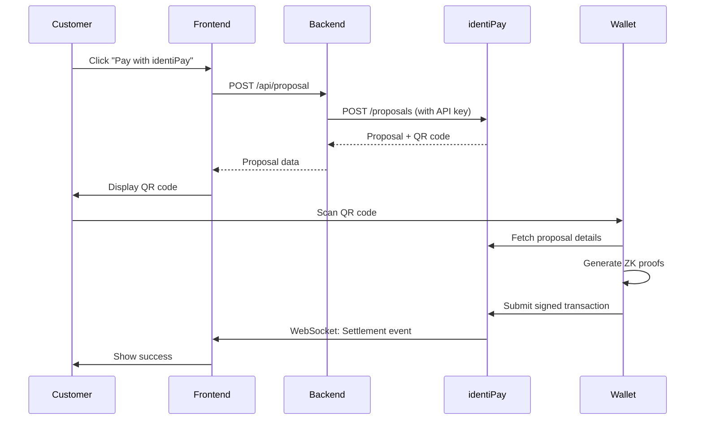

## Overview

The identiPay checkout integration allows customers to pay using the identiPay mobile wallet by scanning a QR code. This guide demonstrates a complete checkout implementation using real code from the identiPay demo store.

## Architecture

The checkout flow involves three components:

1. **Your Frontend**: Displays cart, generates proposals, shows QR codes
2. **Your Backend**: Creates proposals via identiPay API with your API key
3. **identiPay API**: Generates payment proposals and tracks settlement



## Backend: Proposal Creation

Create an API route that forwards proposal creation to identiPay:

<CodeGroup>

```typescript Next.js API Route
// app/api/proposal/route.ts
import { NextResponse } from "next/server";

const BACKEND_URL = process.env.BACKEND_URL || "http://localhost:8000";
const API_KEY = process.env.IDENTIPAY_API_KEY || "";

export async function POST(request: Request) {
  const body = await request.json();

  const res = await fetch(
    `${BACKEND_URL}/api/identipay/v1/proposals`,
    {
      method: "POST",
      headers: {
        "Content-Type": "application/json",
        Authorization: `Bearer ${API_KEY}`,
      },
      body: JSON.stringify(body),
    }
  );

  const data = await res.json();

  if (!res.ok) {
    return NextResponse.json(data, { status: res.status });
  }

  return NextResponse.json(data, { status: 201 });
}
```

```javascript Express.js
// routes/proposal.js
const express = require('express');
const router = express.Router();

const BACKEND_URL = process.env.BACKEND_URL || 'http://localhost:8000';
const API_KEY = process.env.IDENTIPAY_API_KEY || '';

router.post('/api/proposal', async (req, res) => {
  try {
    const response = await fetch(
      `${BACKEND_URL}/api/identipay/v1/proposals`,
      {
        method: 'POST',
        headers: {
          'Content-Type': 'application/json',
          Authorization: `Bearer ${API_KEY}`,
        },
        body: JSON.stringify(req.body),
      }
    );

    const data = await response.json();

    if (!response.ok) {
      return res.status(response.status).json(data);
    }

    res.status(201).json(data);
  } catch (error) {
    res.status(500).json({ error: 'Failed to create proposal' });
  }
});

module.exports = router;
```

</CodeGroup>

<Warning>
**Never expose your API key in frontend code!**

Always create proposals from your backend to keep your API key secure.
</Warning>

## Frontend: Create Proposal

When the customer clicks "Pay with identiPay", create a proposal:

```typescript
const createProposal = async () => {
  setStep("creating");
  setError(null);
  
  try {
    const res = await fetch("/api/proposal", {
      method: "POST",
      headers: { "Content-Type": "application/json" },
      body: JSON.stringify({
        items: items.map((i) => ({
          name: i.product.name,
          quantity: i.quantity,
          unitPrice: i.product.price.toFixed(2),
          currency: i.product.currency,
        })),
        amount: {
          value: total.toFixed(2),
          currency: "USDC",
        },
        deliverables: {
          receipt: true,
        },
        // Add age gate if any item requires it
        ...(maxAgeGate > 0 && {
          constraints: {
            ageGate: maxAgeGate,
          },
        }),
        expiresInSeconds: 900, // 15 minutes
      }),
    });

    if (!res.ok) {
      const errData = await res.json().catch(() => ({}));
      throw new Error(errData.message || "Failed to create proposal");
    }

    const data = await res.json();
    setProposal(data);
    setCountdown(900);
    setStep("pay");
  } catch (err) {
    setError(err instanceof Error ? err.message : "Failed to create proposal");
    setStep("review");
  }
};
```

### Proposal Request Format

<ParamField body="items" type="array" required>
  Array of line items in the cart
  
  <Expandable title="Item properties">
    <ParamField body="name" type="string" required>
      Product or service name
    </ParamField>
    
    <ParamField body="quantity" type="integer" required>
      Quantity (must be positive)
    </ParamField>
    
    <ParamField body="unitPrice" type="string" required>
      Price per unit as a string (e.g., "9.99")
    </ParamField>
    
    <ParamField body="currency" type="string">
      Currency code (defaults to "USDC")
    </ParamField>
  </Expandable>
</ParamField>

<ParamField body="amount" type="object" required>
  Total payment amount
  
  <Expandable title="Amount properties">
    <ParamField body="value" type="string" required>
      Total amount as a string (e.g., "29.99")
    </ParamField>
    
    <ParamField body="currency" type="string" required>
      Currency code (e.g., "USDC")
    </ParamField>
  </Expandable>
</ParamField>

<ParamField body="deliverables" type="object" required>
  What the buyer will receive
  
  <Expandable title="Deliverables properties">
    <ParamField body="receipt" type="boolean" required>
      Whether to deliver an encrypted receipt
    </ParamField>
    
    <ParamField body="warranty" type="object">
      Optional warranty terms
      
      <Expandable title="Warranty properties">
        <ParamField body="durationDays" type="integer" required>
          Warranty duration in days
        </ParamField>
        
        <ParamField body="transferable" type="boolean" required>
          Whether warranty can be transferred
        </ParamField>
      </Expandable>
    </ParamField>
  </Expandable>
</ParamField>

<ParamField body="constraints" type="object">
  Payment constraints (age verification, region locks, etc.)
  
  <Expandable title="Constraint properties">
    <ParamField body="ageGate" type="integer">
      Minimum age required (e.g., 18, 21)
    </ParamField>
    
    <ParamField body="regionRestriction" type="array">
      Array of allowed country codes
    </ParamField>
  </Expandable>
</ParamField>

<ParamField body="expiresInSeconds" type="integer" required>
  Proposal expiration time in seconds (max 86400 = 24 hours)
  
  Default: 900 (15 minutes)
</ParamField>

### Proposal Response Format

```json
{
  "transactionId": "f47ac10b-58cc-4372-a567-0e02b2c3d479",
  "intentHash": "a3d5f8e9c2b1a4d6f8e9c2b1a4d6f8e9c2b1a4d6f8e9c2b1a4d6f8e9c2b1a4d6",
  "qrDataUrl": "data:image/png;base64,iVBORw0KGgoAAAANSUhEUgAA...",
  "uri": "did:identipay:techvault.store:f47ac10b-58cc-4372-a567-0e02b2c3d479",
  "expiresAt": "2026-03-09T15:30:00.000Z"
}
```

<ParamField body="transactionId" type="string">
  Unique transaction identifier (UUID)
</ParamField>

<ParamField body="intentHash" type="string">
  Cryptographic hash of the payment intent
</ParamField>

<ParamField body="qrDataUrl" type="string">
  QR code as a data URL (PNG image)
</ParamField>

<ParamField body="uri" type="string">
  DID-based URI for the proposal (encoded in QR code)
</ParamField>

<ParamField body="expiresAt" type="string">
  ISO 8601 timestamp when proposal expires
</ParamField>

## Display QR Code

Render the QR code for customers to scan:

<CodeGroup>

```typescript React
import { QRCodeSVG } from "qrcode.react";

function PaymentQRCode({ proposal }: { proposal: ProposalData }) {
  return (
    <div className="qr-container">
      <QRCodeSVG
        value={proposal.uri}
        size={200}
        level="M"
        bgColor="#ffffff"
        fgColor="#0a0a0a"
      />
      
      <div className="expiry-timer">
        <span>Expires in {formatTime(countdown)}</span>
      </div>
    </div>
  );
}
```

```html HTML + JavaScript
<div id="qr-container">
  
  <div id="expiry-timer"></div>
</div>

<script>
function displayQRCode(proposal) {
  // Use the pre-generated QR code data URL
  document.getElementById('qr-code').src = proposal.qrDataUrl;
  
  // Start countdown timer
  startCountdown(proposal.expiresAt);
}

function startCountdown(expiresAt) {
  const timer = setInterval(() => {
    const remaining = Math.floor(
      (new Date(expiresAt) - new Date()) / 1000
    );
    
    if (remaining <= 0) {
      clearInterval(timer);
      document.getElementById('expiry-timer').textContent = 'Expired';
      return;
    }
    
    const minutes = Math.floor(remaining / 60);
    const seconds = remaining % 60;
    document.getElementById('expiry-timer').textContent = 
      `Expires in ${minutes}:${seconds.toString().padStart(2, '0')}`;
  }, 1000);
}
</script>
```

</CodeGroup>

## QR Code URI Format

The QR code encodes a DID-based URI:

```
did:identipay:<hostname>:<transaction-id>
```

Example:
```
did:identipay:techvault.store:f47ac10b-58cc-4372-a567-0e02b2c3d479
```

When scanned, the wallet:

1. Parses the DID to extract hostname and transaction ID
2. Fetches proposal details: `GET https://<hostname>/api/identipay/v1/intents/<transaction-id>`
3. Displays payment details to the user
4. Generates required zero-knowledge proofs (age verification, etc.)
5. Signs and submits the settlement transaction

<Note>
The wallet verifies your merchant identity against the on-chain trust registry before allowing payment.
</Note>

## Monitor Settlement Status

Use WebSocket to receive real-time payment updates:

```typescript
useEffect(() => {
  if (step !== "pay" || !proposal?.transactionId) return;

  // Connect to WebSocket
  const protocol = window.location.protocol === "https:" ? "wss:" : "ws:";
  const backendHost = process.env.NEXT_PUBLIC_BACKEND_URL
    ? new URL(process.env.NEXT_PUBLIC_BACKEND_URL).host
    : "localhost:8000";
  
  const wsUrl = `${protocol}//${backendHost}/ws/transactions/${proposal.transactionId}`;
  const ws = new WebSocket(wsUrl);

  ws.onmessage = (event) => {
    try {
      const data = JSON.parse(event.data);
      
      if (data.type === "settlement" || 
          (data.type === "status" && data.status === "settled")) {
        setStep("confirming");
        setTxHash(data.suiTxDigest || "");
        
        // Show success after brief confirming animation
        setTimeout(() => setStep("success"), 2000);
      }
    } catch (error) {
      console.error("Failed to parse WebSocket message", error);
    }
  };

  ws.onerror = (err) => {
    console.error("WebSocket error:", err);
  };

  return () => {
    ws.close();
  };
}, [step, proposal?.transactionId]);
```

See [WebSocket API](/api/websocket) for complete documentation.

## Age-Gated Products

For products requiring age verification, add constraints to your proposal:

```typescript
const items = [
  {
    name: "Premium Vaporizer Kit",
    quantity: 1,
    unitPrice: "15.00",
    currency: "USDC",
  }
];

// Create proposal with age gate
const proposalData = {
  items,
  amount: { value: "15.00", currency: "USDC" },
  deliverables: { receipt: true },
  constraints: {
    ageGate: 18, // Require 18+
  },
  expiresInSeconds: 900,
};
```

The wallet will automatically:
1. Generate a zero-knowledge proof that the user meets the age requirement
2. Submit the proof with the payment
3. **Never reveal the user's actual birthdate or age**

<Info>
Age verification uses zk-SNARKs to prove `current_year - birth_year >= required_age` without revealing the birth year.
</Info>

## Complete Example

Here's a minimal complete checkout implementation:

```typescript
import { useState, useEffect } from "react";
import { QRCodeSVG } from "qrcode.react";

interface ProposalData {
  transactionId: string;
  intentHash: string;
  qrDataUrl: string;
  uri: string;
  expiresAt: string;
}

export default function Checkout({ items, total }: CheckoutProps) {
  const [step, setStep] = useState<"review" | "pay" | "success">("review");
  const [proposal, setProposal] = useState<ProposalData | null>(null);
  const [countdown, setCountdown] = useState(900);

  const createProposal = async () => {
    const res = await fetch("/api/proposal", {
      method: "POST",
      headers: { "Content-Type": "application/json" },
      body: JSON.stringify({
        items,
        amount: { value: total.toFixed(2), currency: "USDC" },
        deliverables: { receipt: true },
        expiresInSeconds: 900,
      }),
    });

    const data = await res.json();
    setProposal(data);
    setStep("pay");
  };

  // Countdown timer
  useEffect(() => {
    if (step !== "pay") return;
    const interval = setInterval(() => {
      setCountdown((prev) => Math.max(0, prev - 1));
    }, 1000);
    return () => clearInterval(interval);
  }, [step]);

  // WebSocket listener
  useEffect(() => {
    if (step !== "pay" || !proposal) return;

    const ws = new WebSocket(
      `wss://api.identipay.net/ws/transactions/${proposal.transactionId}`
    );

    ws.onmessage = (event) => {
      const data = JSON.parse(event.data);
      if (data.type === "settlement" && data.status === "settled") {
        setStep("success");
      }
    };

    return () => ws.close();
  }, [step, proposal]);

  if (step === "review") {
    return (
      <button onClick={createProposal}>
        Pay {total.toFixed(2)} USDC with identiPay
      </button>
    );
  }

  if (step === "pay" && proposal) {
    return (
      <div>
        <h2>Scan to pay</h2>
        <QRCodeSVG value={proposal.uri} size={200} />
        <p>Expires in {Math.floor(countdown / 60)}:{(countdown % 60).toString().padStart(2, '0')}</p>
      </div>
    );
  }

  if (step === "success") {
    return <h2>Payment successful!</h2>;
  }

  return null;
}
```

## Testing

Test your integration:

1. **Use Sandbox Mode**: Set `BACKEND_URL` to the sandbox API endpoint
2. **Install identiPay Wallet**: Download the test wallet app
3. **Fund Test Wallet**: Get test USDC from the faucet
4. **Complete Test Purchase**: Scan QR code and verify settlement

Test your integration locally using the Sui testnet or devnet.

## Next Steps

<CardGroup cols={2}>
  <Card title="Payment Flow" icon="arrow-right-arrow-left" href="/integration/payment-flow">
    Understand the complete payment lifecycle
  </Card>
  <Card title="WebSocket API" icon="satellite-dish" href="/integration/webhooks">
    Real-time settlement notifications
  </Card>
</CardGroup>
