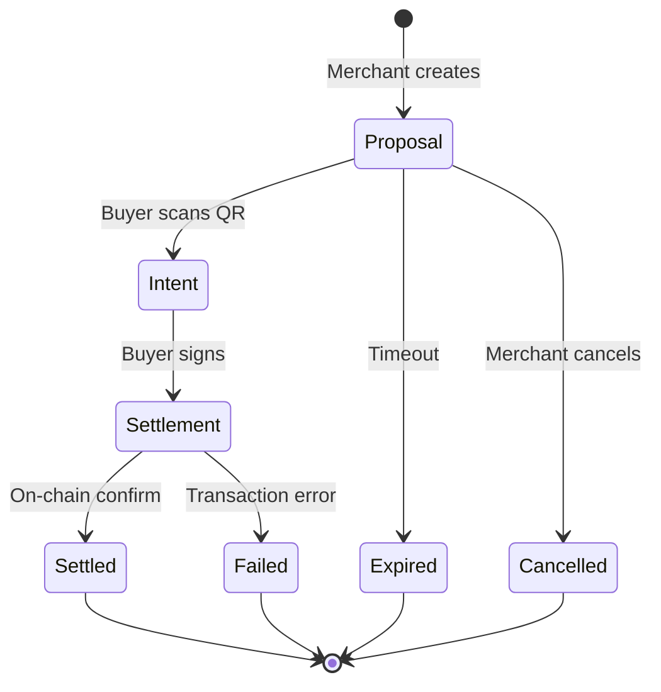

## Overview

The identiPay payment flow consists of three main phases:

1. **Proposal**: Merchant creates a payment intent
2. **Intent**: Buyer reviews and signs the intent
3. **Settlement**: Atomic on-chain execution with ZK proofs

Each phase maintains privacy while ensuring cryptographic verifiability.

## Payment Lifecycle



## Phase 1: Proposal Creation

The merchant creates a **CommerceProposal** containing all transaction details.

### Creating a Proposal

```typescript
POST /api/identipay/v1/proposals
Authorization: Bearer idpay_sk_...
```

```json
{
  "items": [
    {
      "name": "Studio Monitor Headphones",
      "quantity": 1,
      "unitPrice": "0.25",
      "currency": "USDC"
    },
    {
      "name": "Mechanical Keyboard",
      "quantity": 1,
      "unitPrice": "0.18",
      "currency": "USDC"
    }
  ],
  "amount": {
    "value": "0.43",
    "currency": "USDC"
  },
  "deliverables": {
    "receipt": true,
    "warranty": {
      "durationDays": 365,
      "transferable": true
    }
  },
  "constraints": {
    "ageGate": 18
  },
  "expiresInSeconds": 900
}
```

### Proposal Generation

The backend:

1. **Validates** the request against the merchant's API key
2. **Generates** a unique `transactionId` (UUID)
3. **Builds** the full JSON-LD CommerceProposal:

```json
{
  "@context": "https://schema.identipay.net/v1",
  "@type": "CommerceProposal",
  "transactionId": "f47ac10b-58cc-4372-a567-0e02b2c3d479",
  "merchant": {
    "did": "did:identipay:techvault.store:ccd20e4a-ae80-49f3-862c-2f05c2714d1b",
    "name": "TechVault",
    "suiAddress": "0x9f9a52525712f64c6225f076857cb5c32096c203a499760f43749ee360d4a5fa",
    "publicKey": "a6317b7521f98e96e8ac16dab916af8fdc3f65be3e7305954f219f6ca64dcdb5"
  },
  "items": [...],
  "amount": { "value": "0.43", "currency": "USDC" },
  "deliverables": {...},
  "constraints": { "ageGate": 18 },
  "expiresAt": "2026-03-09T15:30:00.000Z",
  "intentHash": "a3d5f8e9c2b1a4d6f8e9c2b1a4d6f8e9c2b1a4d6f8e9c2b1a4d6f8e9c2b1a4d6",
  "settlementChain": "sui",
  "settlementModule": "0xPackageId::settlement"
}
```

4. **Computes** the `intentHash` (cryptographic hash of all fields)
5. **Generates** QR code containing the DID URI
6. **Stores** proposal in database with status `pending`

### Intent Hash

The intent hash is a SHA-256 hash of the canonical JSON representation:

```typescript
// From backend source: src/services/proposal.service.ts
import { sha256 } from "@noble/hashes/sha256";
import { bytesToHex } from "@noble/hashes/utils";

function computeIntentHash(proposal: CommerceProposal): string {
  // Create canonical representation (deterministic field order)
  const canonical = JSON.stringify({
    transactionId: proposal.transactionId,
    merchant: proposal.merchant,
    items: proposal.items,
    amount: proposal.amount,
    deliverables: proposal.deliverables,
    constraints: proposal.constraints,
    expiresAt: proposal.expiresAt,
    settlementChain: proposal.settlementChain,
    settlementModule: proposal.settlementModule,
  });

  const hash = sha256(new TextEncoder().encode(canonical));
  return bytesToHex(hash);
}
```

This hash is signed by the buyer and verified on-chain.

### Database State

```sql
INSERT INTO proposals (
  transaction_id,
  merchant_id,
  proposal_json,
  intent_hash,
  status,
  expires_at
) VALUES (
  'f47ac10b-58cc-4372-a567-0e02b2c3d479',
  'ccd20e4a-ae80-49f3-862c-2f05c2714d1b',
  '{...}',  -- Full JSON proposal
  'a3d5f8e9...',
  'pending',
  '2026-03-09 15:30:00'
);
```

## Phase 2: Intent Resolution

The buyer scans the QR code and the wallet fetches proposal details.

### Wallet QR Scan

1. **Scan QR code**: Contains `did:identipay:techvault.store:f47ac10b-58cc-4372-a567-0e02b2c3d479`
2. **Parse DID**: Extract hostname (`techvault.store`) and transaction ID
3. **Fetch proposal**:

```typescript
GET https://techvault.store/api/identipay/v1/intents/f47ac10b-58cc-4372-a567-0e02b2c3d479
```

<Note>
This endpoint is **public** and does not require authentication. The wallet needs to fetch proposal details before the buyer has authenticated.
</Note>

### Backend Intent Handler

From `backend/src/routes/intents.ts:10-42`:

```typescript
app.get("/:txId", async (c) => {
  const txId = c.req.param("txId");

  const [proposal] = await deps.db
    .select()
    .from(proposals)
    .where(eq(proposals.transactionId, txId))
    .limit(1);

  if (!proposal) {
    throw new NotFoundError("Proposal not found");
  }

  // Check expiry
  if (new Date(proposal.expiresAt) < new Date()) {
    if (proposal.status === "pending") {
      await deps.db
        .update(proposals)
        .set({ status: "expired" })
        .where(eq(proposals.transactionId, txId));
    }
    throw new ValidationError("Proposal has expired");
  }

  if (proposal.status === "cancelled") {
    throw new ValidationError("Proposal has been cancelled");
  }

  return c.json(proposal.proposalJson);
});
```

### Wallet Verification

Before showing the payment to the user, the wallet:

1. **Verifies merchant DID** against on-chain trust registry
2. **Validates intent hash** matches proposal content
3. **Checks expiration** time
4. **Displays** merchant name, items, amount to user

### User Review & Approval

The wallet presents:

```
Pay 0.43 USDC to TechVault

Items:
• Studio Monitor Headphones (1x) - 0.25 USDC
• Mechanical Keyboard (1x) - 0.18 USDC

Age verification required: 18+
Your age will be verified using zero-knowledge proof.
Your birthdate will not be shared.

You will receive:
✓ Encrypted receipt
✓ 1-year transferable warranty

[Cancel] [Approve Payment]
```

## Phase 3: Settlement

Once the buyer approves, the wallet constructs and submits the settlement transaction.

### Pre-Settlement: ZK Proof Generation

If age verification is required:

```typescript
// Wallet generates ZK proof
const proof = await generateAgeProof({
  birthYear: userBirthYear,        // Private input
  currentYear: 2026,               // Public input
  requiredAge: 18,                 // Public input
  identityCommitment: commitment,  // Public input
});

// Proof output:
{
  proof: Uint8Array(256),           // zk-SNARK proof
  publicInputs: [                   
    currentYear - requiredAge,      // 2008 (threshold year)
    identityCommitment,             // User's identity commitment
  ]
}
```

The proof proves: `birthYear <= (currentYear - requiredAge)` **without revealing `birthYear`**.

### Stealth Address Generation

The wallet generates a one-time stealth address for receipt delivery:

```typescript
// From buyer's meta-address (spendPubkey, viewPubkey)
const ephemeralKey = randomBytes(32);
const stealthAddress = deriveStealthAddress(
  merchantPublicKey,
  buyerViewKey,
  buyerSpendKey,
  ephemeralKey
);

const viewTag = computeViewTag(sharedSecret); // First 4 bytes
```

This ensures:
- Merchant **cannot link** this payment to buyer's identity
- Only buyer can decrypt receipt using their view key
- No address reuse (every payment uses unique address)

### Settlement Transaction Construction

The wallet builds a sponsored transaction:

```typescript
POST /api/identipay/v1/transactions/gas-sponsor
```

```json
{
  "type": "settlement",
  "senderAddress": "0xBuyerAddress",
  "coinType": "0x2::sui::SUI",
  "amount": "430000",
  "merchantAddress": "0x9f9a52525712f64c6225f076857cb5c32096c203a499760f43749ee360d4a5fa",
  "buyerStealthAddr": "0xGeneratedStealthAddress",
  "intentSig": [/* buyer's signature of intentHash */],
  "intentHash": [/* 32 bytes */],
  "buyerPubkey": [/* 32 bytes */],
  "proposalExpiry": "1709999400000",
  "encryptedPayload": [/* encrypted receipt data */],
  "payloadNonce": [/* 24 bytes */],
  "ephemeralPubkey": [/* 32 bytes for stealth */],
  "encryptedWarrantyTerms": [/* encrypted warranty */],
  "warrantyTermsNonce": [/* 24 bytes */],
  "warrantyExpiry": "1741535400000",
  "warrantyTransferable": true,
  "stealthEphemeralPubkey": [/* 32 bytes */],
  "stealthViewTag": 42,
  "zkProof": [/* 256 bytes zk-SNARK */],
  "zkPublicInputs": [/* public inputs */]
}
```

### Backend Gas Sponsorship

From `backend/src/routes/transactions.ts:43-70`:

```typescript
if (body.type === "settlement" || body.type === "settlement_no_zk") {
  const params = body as Record<string, unknown>;
  if (!params.amount || !params.merchantAddress) {
    throw new ValidationError("Missing required settlement parameters");
  }
  txBytes = await deps.suiService.buildSponsoredSettlement({
    senderAddress: params.senderAddress as string,
    coinId: params.coinId as string | undefined,
    coinType: params.coinType as string,
    amount: String(params.amount),
    merchantAddress: params.merchantAddress as string,
    buyerStealthAddr: params.buyerStealthAddr as string,
    intentSig: params.intentSig as number[],
    intentHash: params.intentHash as number[],
    buyerPubkey: params.buyerPubkey as number[],
    proposalExpiry: String(params.proposalExpiry),
    encryptedPayload: params.encryptedPayload as number[],
    payloadNonce: params.payloadNonce as number[],
    ephemeralPubkey: params.ephemeralPubkey as number[],
    // ... warranty and ZK fields
  });
}
```

Backend returns unsigned transaction bytes. Wallet signs and submits:

```typescript
POST /api/identipay/v1/transactions/submit
```

```json
{
  "txBytes": "base64EncodedTransactionBytes",
  "senderSignature": "base64EncodedSignature"
}
```

Backend co-signs as gas sponsor and submits to Sui network.

### On-Chain Verification

The Sui Move smart contract verifies:

1. **Intent signature**: Buyer actually signed the `intentHash`
2. **Merchant identity**: DID matches trust registry
3. **Expiration**: Current time < proposal expiry
4. **ZK proof** (if required): Age constraint satisfied
5. **Amount**: Matches proposal exactly

If all checks pass:

1. **Transfer** USDC from buyer to merchant
2. **Emit** `StealthAnnouncement` event with stealth address and ephemeral key
3. **Mint** encrypted receipt NFT to buyer's stealth address
4. **Mint** warranty NFT (if applicable)

### Settlement Event

On-chain event emitted:

```rust
event StealthAnnouncement {
  stealth_address: address,
  ephemeral_pubkey: vector<u8>,
  view_tag: u8,
  tx_digest: vector<u8>,
  encrypted_payload: vector<u8>,
  encrypted_warranty: vector<u8>,
}
```

The backend:
1. **Listens** for `StealthAnnouncement` events
2. **Updates** proposal status to `settled`
3. **Stores** Sui transaction digest
4. **Pushes** WebSocket notification to merchant

```typescript
// From backend/src/ws/status.ts:81-103
export function pushSettlementUpdate(
  txId: string,
  status: string,
  suiTxDigest: string,
) {
  const set = connections.get(txId);
  if (!set) return;

  const message = JSON.stringify({
    type: "settlement",
    transactionId: txId,
    status,
    suiTxDigest,
  });

  for (const ws of set) {
    try {
      ws.send(message);
    } catch {
      set.delete(ws);
    }
  }
}
```

## State Transitions

### Proposal Status Flow

<Steps>
  <Step title="pending">
    Initial state after proposal creation. Waiting for buyer to scan and pay.
  </Step>
  
  <Step title="settled">
    Payment completed successfully. Transaction confirmed on Sui blockchain.
  </Step>
  
  <Step title="expired">
    Proposal exceeded `expiresAt` timestamp without settlement.
  </Step>
  
  <Step title="cancelled">
    Merchant cancelled the proposal before settlement.
  </Step>
</Steps>

### Database Schema

From `backend/src/db/schema.ts:15-20`:

```typescript
export const proposalStatusEnum = pgEnum("proposal_status", [
  "pending",
  "settled",
  "expired",
  "cancelled",
]);
```

### Status Transitions

```typescript
pending → settled     // Payment successful
pending → expired     // Timeout
pending → cancelled   // Merchant cancellation

// Terminal states (no further transitions):
settled, expired, cancelled
```

## Privacy Guarantees

Throughout the payment flow:

### Merchant Privacy

- **Public**: DID, name, Sui address (from trust registry)
- **Private**: API key, customer list, sales analytics

### Buyer Privacy

- **Public**: Nothing (completely anonymous)
- **Private**: Identity, age, address, purchase history
- **On-chain**: Only stealth address (not linkable to buyer)

### Receipt Privacy

- **Encrypted** with buyer's public key
- **Delivered** to stealth address
- **Only buyer** can decrypt with view key
- **Merchant cannot** read receipt or link to buyer

### Zero-Knowledge Proofs

- **Age verification**: Proves age >= threshold without revealing birthdate
- **Identity commitment**: Proves ownership without revealing identity
- **No personal data** revealed to merchant or blockchain

## Error Handling

### Common Errors

<ParamField body="ProposalNotFound" type="404">
  Transaction ID does not exist or has been deleted
</ParamField>

<ParamField body="ProposalExpired" type="400">
  Proposal exceeded expiration time
</ParamField>

<ParamField body="ProposalCancelled" type="400">
  Merchant cancelled the proposal
</ParamField>

<ParamField body="InvalidIntentSignature" type="400">
  Buyer's signature does not match intent hash
</ParamField>

<ParamField body="ZKProofVerificationFailed" type="400">
  Zero-knowledge proof is invalid or does not satisfy constraints
</ParamField>

<ParamField body="InsufficientFunds" type="400">
  Buyer's wallet has insufficient balance
</ParamField>

<ParamField body="MerchantNotInRegistry" type="400">
  Merchant DID not found in on-chain trust registry
</ParamField>

### Retry Logic

If settlement transaction fails:

1. **Wallet retries** up to 3 times with exponential backoff
2. **Backend re-sponsors** transaction if gas price changed
3. **After 3 failures**: Show error to user, proposal remains `pending`
4. **User can retry** manually within expiration window

## Testing

Test the complete flow:

```typescript
// 1. Create proposal
const proposal = await createProposal({
  items: [{ name: "Test Item", quantity: 1, unitPrice: "1.00" }],
  amount: { value: "1.00", currency: "USDC" },
  deliverables: { receipt: true },
  expiresInSeconds: 900,
});

// 2. Simulate wallet scan
const intent = await fetch(
  `https://api.identipay.net/api/identipay/v1/intents/${proposal.transactionId}`
).then(r => r.json());

// 3. Check settlement status
const status = await fetch(
  `https://api.identipay.net/api/identipay/v1/transactions/${proposal.transactionId}/status`,
  { headers: { Authorization: `Bearer ${apiKey}` } }
).then(r => r.json());
```

## Next Steps

<CardGroup cols={2}>
  <Card title="WebSocket API" icon="satellite-dish" href="/integration/webhooks">
    Receive real-time settlement notifications
  </Card>
</CardGroup>
